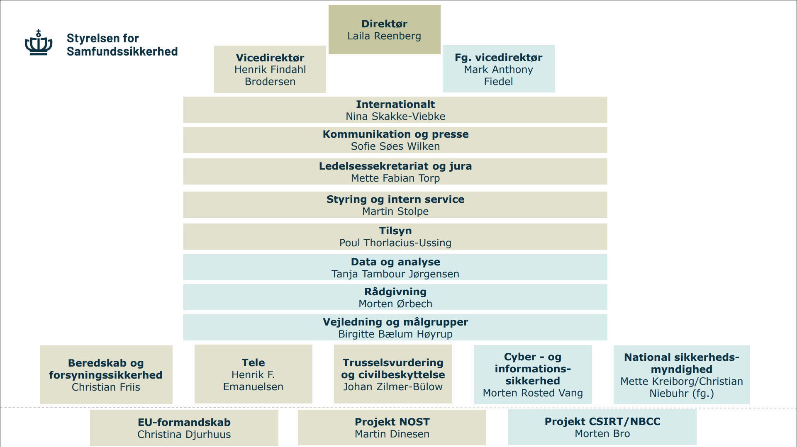

# Hvad er IT-Governance?

??? note "Læringsmål"

    **Overordnede læringsmål fra studie ordningen**

    Viden

    - Videregående it-governance
    - Principper indenfor it-sikkerhed
    - Risikoanalyse
    - Standarder og organisationer i sikkerhedsarbejdet
    
    **Læringsmål den studerende kan bruge til selvvurdering**

    Viden

    - Den studerende ved hvad it-governance er
    - Den studerende har viden om grundlæggende cyberforsvar

    Færdigheder

    - Den studerende kan forklare hvad it-governance er

??? note "Forberedelse"
    Ingen forberedelse

## Opgave - Fagets læringsmål

??? note "Opgave beskrivelse"

    **Information**

    I denne øvelse skal i undersøge fagets læringsmål.

    Formålet er at sikre at i ved:

    - hvor læringsmålene kan findes
    - hvad de betyder
    - hvad i kan bruge dem til og ikke mindst, bliver det lettere at huske læringsmålene hvis i har arbejdet lidt med dem.

    **Instruktioner**

    - Find læringsmålene og del linket mellem jer
    - I jeres gruppe tal sammen om, hvordan de er relevante for faget og hvordan i forstår/ikke forstår dem.Skriv de spørgsmål ned i identificerer mens i taler.
    - Forbered at præsentere et læringsmål på klassen (ikke på tavlen, bare siddende)

Man kan finde læringsmålene [her](https://esdhweb.ucl.dk/D22-1980440.pdf).

Vi snakkede sammen, og der var god forståelse for de forskellige læringsmål. Vi lod dog mærke til, at der var forskel på IT governance og videregående IT governance, hvor der stod risikoanalyse og risikoanalyse inden for IT sikkerhed. Det var det vi endte med at snakke om, om der er forskel på en generel risikoanalyse og en inden for IT sikkerhed.

## Opave - Organisationsforståelse

??? note "Opgave beksrivelse"

    **Information**

    Virksomheder og organisationer kan være meget forskellige.
    Størrelsen på virksomheder omtales på forskellige måder.

    Det kan for eksempel være efter:

    - [regnskabsklasser](https://erhvervsstyrelsen.dk/vejledning-aarsrapporter)
    - [D-Mærkets virksomhedsgrupper](https://www.d-maerket.dk/bliv-d-maerket/virksomhedsgrupper)
    - [CIS Implementation Groups](https://www.cisecurity.org/controls/implementation-groups)

    Måden, virksomhederne er indrettet på i forhold til virksomhedens afdelinger og ansvarsområder, skitseres som regel – i hvert fald hvis det er en større virksomhed – i et organisationsdiagram.

    Et organisationsdiagram er en visuel oversigt, der viser, hvordan en virksomhed eller organisation er struktureret. Det illustrerer, hvem der har hvilke roller, hvem der rapporterer til hvem, og hvordan forskellige afdelinger og medarbejdere er forbundet.

    Organisationer tildeler titler til de forskellige ledelsesroller og afdelinger. For eksempel bruges nedenstående:

    |Titel eller afdeling|Forkortelse|
    |---|---|
    |Chief Executive Officer|	CEO|
    |Chief Technology Officer|	CTO|
    |Chief Information Officer|	CIO|
    |Chief Information Security Officer|	CISO|
    |Chief Operating Officer|	COO|
    |Chief Financial Officer|	CFO|
    |Vice President	|VP|
    |Quality Assurance|	QA|
    |Human Resources	|HR|

    Formålet med denne øvelse er at få en forståelse for, hvordan en virksomhed typisk indretter sig hierarkisk, samt at I identificerer de roller i virksomheden, der er centrale i arbejdet med sikkerhed.

    **Instruktioner**

    - Find mindst ét organisationsdiagram, der inkluderer en it-afdeling. Det kan være svært at finde et godt eksempel.
    - På diagrammet skal I prøve at udpege, hvilke ledelsesroller der er ansvarlige for it-sikkerheden i virksomheden.
    - Skriv titler for de forskellige roller samt hvad deres ansvarsområde typisk dækker.

I gruppen fandt vi frem til Styrelsen for Samfundssikkerhed
som har dette organisationsdiagram:

Og fandt frem til Motren Rosted Vang som er ansvarlig for IT sikkerhed i organisationen. Hans stilling er Kontorchef for Cyber Kontoret eller Chief information security officer (CISO)

## Opave - Hvad er IT-Governance?

??? note "Opgave beskrivelse"

    1. Undersøg, hvad ordet Governance betyder oversat til dansk.
    2. I jeres gruppe, find kilder på internettet, der definerer hvad IT-Governance er.
    3. Ud fra jeres research skal I blive enige i gruppen om en forklaring på, hvad IT-Governance er. Brug jeres egne ord og forståelse.

1. Vi har oversat "Governance" til styring eller ledelse
2. Vi fandt følgende link:
    1. [https://www.itgovernance.co.uk/it-governance ](https://www.itgovernance.co.uk/it-governance)
    2. [https://www.ibm.com/think/topics/it-governance](https://www.ibm.com/think/topics/it-governance )
3. IT-governance er et begreb som strækker sig over styring af organisatoriske ledelse og risici, samtidig med at den dækker over branche- og regerings regler som en organisation kan ligge under såsom GDPR eller NIS2. Implementering af IT-governance kræver IT-investeringer, politikker og personale. Det hjælper organisationer med at matche deres IT-mål med forretningsmål.

## Opave - Grundlæggende cyberforsvar

??? note "Opgave beskrivelse"

    1. Hent CFCS vejledningen [Cyberforsvar der virker](https://www.cfcs.dk/da/forebyggelse/vejledninger/cyberforsvar-der-virker/)
    2. Læs vejledningen og besvar følgende spørgsmål skriftligt:

        1. Hvad er ledelsens rolle?
        2. Hvilke værktøjer kan ledelsen benytte sig af?
        3. Hvorfor skal ledelsen stille spørgsmål til sig selv?
        4. Hvorfor skal ledelsen still spørgsmål til sin organisation?
        5.  Hvilke af de 10 tekniske tiltag ville i starte med, hvis skulle implementere et Cyberforsvar? og hvorfor?
        6. Hvilke standarder og best practices omtales der i vejledningen?
        7. Er tekniske tiltag vigtigere en adfærdstiltag?
        8. Vil en virksomhed være sikret mod trusselsaktører (ondsindede hackere/aktører) hvis de følger vejledningen?
        9. Hvilke faser indgår der i krisehåndteringscyklussen?
        10. Hvordan kan en virksomhed afprøve deres cyberforsvar?

1. “Ledelsen skal styre cyber- og informationssikkerheden ved løbende at støtte, prioritere og følge op på målsætninger og strategier efter samme principper som inden for f.eks. økonomi og HR”
2. De gode spørgsmål er vigtige værktøjer
    1. Ved vi, hvilke data og informationer der understøtter vores forretningskritiske aktiviteter?
    2. Hvilke konsekvenser har det for forretningen, hvis data og informationer, der understøtter vores forretningskritiske aktiviteter, ikke er tilgængelige, ændres eller lækkes?
    3. Er vi overbevist om, at vores informationer er tilstrækkeligt beskyttet i forhold til kendte trusler?
    4. Har vi i topledelsen defineret målsætninger, strategier eller politikker på cyber- og informationssikkerhedsområdet, som vi aktivt prioriterer og støtter?
    5. Har vi en sikkerhedsorganisation, der er forankret i topledelsen?
    6. Modtager vi løbende rapportering om status på strategier og målsætninger inden for cyber- og informationssikkerhedsområdet?
    7. Har topledelsen taget stilling til myndighedens eller virksomhedens risikoappetit?
    8. Har vi gjort os klart, at topledelsen selv er et oplagt mål for cyberangreb (eksempelvis CEO-fraud, og spear-phishing)?
3. spørgsmålene fungerer som værktøj for ledelsens styringen af cyber- og informationssikkerhedsområdet
4. Svarene på spørgsmålene vil være med til at synliggøre for ledelsen, hvis der er områder i organisationen der trænger til at blive prioriteret.
5. Segmenter netværket (nummer 2) Så har man begrænset for hvem der kan have adgang også kan man begynde med at implementer de andre tiltag
6. ISO 27001, NIST Cybersecurity Framework, SANS og CIS 18
7. Nej. Da man skal vide at der er nogle ting der ikke må gøres
8. De er mere sikre
9. Reetablering, Isolering og Eliminering
10. Pen-testing
