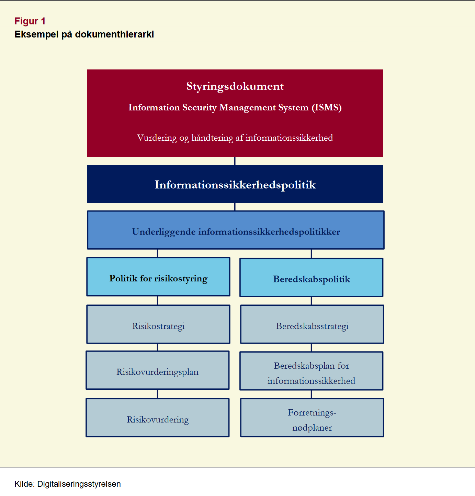

# Dokumentation

!!! note "Læringsmål"

    **Viden**

    Den studerende har viden om og forståelse for:

    - Standarder og organisationer i sikkerhedsarbejdet
    - Sikkerhedspolitikker og -procedurer

    **Færdigheder**

    Den studerende kan:

    - Søge information og navigere i standarder, og anvende det i de systemer, de benytter
    - Navigere i og indhente oplysninger om gældende love og regler inden for it-sikkerhedsrelevante emner

    **Kompetencer**

    Den studerende kan:

    - Udarbejde specifikke IT-sikkerhedspolitikker for en given organisation

!!! note "Forberedelse"

    - Læs ISO27001:2023 - Fokuser på alle de steder, der nævner krav til dokumenteret information

## Opgave - Identifikation af dokumentationskrav i ISO27001

!!! note "Opgave beskrivelse"

    1. Gennemgå ISO 27001:2023 og identificer alle krav til dokumenteret information.
    1. Dokumenter dokumentationskravene i et dokument med 3 kolonner som eksemplet herunder:
    
        |ISO27001:2023 afsnit 	|Hvad skal dokumenteres? 	|Dokument det skal dokumenteres i|
        |---|---|---|
        |(eks. 4.3) 	|(eks. omfanget af ledelsessystemet for informationssikkerhed) |	(eks. informationssikkerhedspolitikken)|

    1. Sammenlign jeres liste med en anden gruppe for at sikre, at I har fanget alle relevante krav. Hvis der er uoverenstemmelser, diskuter og opdater jeres liste efter behov.

|ISO27001:2023 afsnit|Hvad skal dokumenteres?|Dokument det skal dokumenteres i|
|---|---|---|
|4.3|omfanget af ledelsessystemet for informationssikkerhed|informationssikkerhedspolitikken|
|5.2|Håndtering af informationssikkerhedspolitik|informationssikkerhedspolitikken|
|6.1|Processen for håndtering af informations-sikkerhedsrisici.|Informationssikkerhedspolitikken Handleplan|
|6.2|Målsætninger for informationssikkerhed og planlægning for opfyldelse|informationssikkerhedspolitikken|
|7.5|Information som som organisationen har fastlagt er nødvendig for planlægningen og driften af ledelsessystemet for informationssikkerhed|Dokumentationen for organisationens ledelsessystemet| 
|8.1|Dokumentation af: Etablering af kriterier for processerne, implementere styring af processerne i overensstemmelse med kriterierne.|Ikke specificeret. Dokumentationen skal bare være tilgængeligt. “Dokumenteret information skal være tilgængelig i det omfang, der er nødvendigt for at have tillid til, at processerne er udført som planlagt.” |
|8.2|vurderinger af informationssikkerhedsrisici med planlagte mellemrum, eller når væsentlige ændringer foreslås eller finder sted under hensyntagen til kriterierne|Organisationen skal opbevare dokumenteret information om resultaterne af vurderingerne af informationssikkerhedrisiciene.|
|8.3|Implementering af en plan for håndtering af informationssikkerhedsrisici.|Organisationen skal opbevare dokumenteret information om resultaterne af håndteringen af informationssikkerhedrisiciene|
|9.1|Håndtering af overvågning|informationssikkerhedspolitikken|
|9.2|Dokumentation af interne audit der handler om at informere om, hvorvidt ledelsessystemet for informationssikkerhed er i overensstemmelse med diverse krav|“Dokumenteret information skal være tilgængelig som bevis for auditprogrammets eller -programmernes implementering og auditresultaterne”|
|9.3|Topledelsen skal gennemgå organisationens ledelsessystem for informationssikkerhed med planlagte mellemrum for at sikre systemets fortsatte egnethed, tilstrækkelighed og effektivitet.|Dokumenteret information skal være tilgængelig som bevis for resultaterne af ledelsens evalueringer.|
|10.2|Dokumentationen skal være bevis for: arten af afvigelser og de efterfølgende iværksatte handlinger resultaterne af en eventuel korrigerende handling|Ikke specificeret. Dokumentationen skal bare være tilgængeligt.|

Oftest viste vi ikke helt i hvilket dokument de forskelige afsnit skulle dokumenteres i. Det kan være op til virksomheden selv. Så længe det er nemt tilgængeligt.

Efter snak med en anden gruppe, tilføjer vi følgende punkter til listen ovenfor: 5.2, 9.1, 9.3

## Opgave - Virksomhedscase: Politikker og procedurer

!!! note "Opgave beskrivelse"

    1. Genbesøg de 3 dokumenter - dokumenterne er på itslearning
        - [Dokument 1](./it-sikkerhedspolitik_Sentinel_Surveillance_Systems_v1.0.pdf)
        - [Dokument 2](./it-sikkerhedspolitik_bilag1_Retningslinjer_20for_20drift_Sentinel_Surveillance_Systems_v1.0.pdf)
        - [Dokument 3](./it-sikkerhedspolitik_bilag2-retningslinjer-for-brugere_Sentinel_Surveillance_Systems_v1.0.pdf)
    1. Undersøg ud fra dokumenthierakiet hvilke politikker og procedurer Sentinel Surveillance Systems mangler
        
        (som yderligere inspiration til hvad der mangler er i velkomne til at anvende de it-sikkerhedspolitikker jeg linker til herunder, i må også gerne bruge jeres egne).
    1. Udvælg en eller flere dele af en eksisterende, eller manglende politik eller retningslinje, i vil omskrive til en procedure i næste øvelse.

dokumenthierakiet:

## Opgave - Kompleksitet og målgrupper i dokumentation

!!! note "Opgave beskrivelse"

    1. Jeres opgave er at udvikle en procedure der kan bruges i praksis, baseret på den del af it-sikkerhedspolitikken i valgte i Øvelse 51
    1. Diskuter følgende i jeres gruppe:
        - Hvordan kan i tilpasse sikkerhedsprocedurer, så de føles relevante for begge grupper?
        - Hvilke konkrete eksempler kan i bruge for at illustrere procedurens relevans for begge grupper?
        - Er det muligt at lave en samlet procedure til begge grupper, eller er det nødvendigt at lave 2 målrettede procedurer?
    1. Skriv en procedure der er målrettet begge grupper hvis det er muligt, alternativt en procedure der er målrettet en enkelt gruppe.
    1. Afprøv jeres procedure på en anden gruppe ved at:
        - Bede dem læs proceduren
        - Spørge dem om der er dele af proceduren der virker uklare (hvis ja hvordan kan proceduren rettes?)

??? note "Gruppe 1 og 2"

    Gruppe 1: Udviklingsteams (Hardware & Software)

    **Rolle**: Udvikler og vedligeholder virksomhedens hardware- og softwareløsninger.
    
    **Prioriteter**:

    |Prioritet|Beskrivelse|
    |---|---|
    |Innovation|Fokus på nye funktioner, ydeevne og konkurrencefordel.|
    |Kvalitet og stabilitet|Minimere bugs og sikre robuste, pålidelige produkter.|
    |Sikkerhed (Security by Design)|Sikkerhed indtænkes i designfasen, men kan opfattes som en "nødvendig forhindring".|
    |Agile metoder|Hurtige iterationscyklusser og fleksibilitet.|

    **Interesser og kulturelle kendetegn**

    |Kendetegn|Beskrivelse|
    |---|---|
    |Teknologisk nysgerrighed|Interesseret i nye teknologier, værktøjer og metoder.|
    |Autonomi|Foretrækker selvstændighed og minimal mikrostyring.|
    |Kreativitet|Løser problemer innovativt, men kan overse standardiserede procedurer.|
    |Faglig stolthed|Identificerer sig med produktets kvalitet og tekniske løsninger.|
    |Tidspres|Deadlines kan føre til, at sikkerhedsprocedurer prioriteres lavere.|

    **Potentielle udfordringer med it-sikkerhed**

    - Opfatter sikkerhedspolitikker som "bureaukratiske" eller "tidskrævende".
    - Risiko for at omgå sikkerhedsprocedurer for at nå deadlines.
    - Manglende bevidsthed om, hvordan deres arbejde påvirker den samlede sikkerhed.

    Gruppe 2: Supportteams (24/7 Kundesupport)

    **Rolle**: Hjælper kunder med softwareopdateringer, fejlfinding og problemløsning døgnet rundt.

    **Prioriteter**

    |Prioritet|Beskrivelse|
    |---|---|
    |Kundetilfredshed|Hurtig og effektiv løsning af kunders problemer.|
    |Stabilitet og driftssikkerhed|Minimere nedetid og sikre problemfri drift.|
    |Standardisering|Brug af dokumenterede procedurer og værktøjer.|
    |Reaktionstid|Hurtig respons på henvendelser, især i kritiske situationer.|

    **Interesser og kulturelle kendetegn**

    |Kendetegn|Beskrivelse|
    |---|---|
    |Serviceorienteret|Fokus på at hjælpe kunder og skabe gode relationer.|
    |Struktur og klarhed|Foretrækker klare retningslinjer og trin-for-trin procedurer.|
    |Teamarbejde|Samarbejder tæt med kolleger for at løse komplekse problemer.|
    |Stresshåndtering|Arbejder under pres og håndterer uforudsete situationer.|
    |Praktisk tilgang|Fokus på, hvad der virker i praksis, frem for teoretiske overvejelser.|

    **Potentielle udfordringer med it-sikkerhed**

    - Prioriterer hurtige løsninger frem for sikkerhedsprotokoller (f.eks. midlertidige adgangsrettigheder).
    - Manglende opdatering på nye sikkerhedstrusler eller procedurer.
    - Risiko for at dele følsomme oplysninger uden korrekt godkendelse.

I gruppen mener vi at man godt kan lave en samlet procedure. og vores ser sådan ud:

> Hvis en medarbejder opdager trusler mod, eller brud på, informationssikkerheden, eller får mistanke om det, skal vedkommende straks underrette ledelsen om dette. Ledelsen informerer derefter alle relevante afdelingsledere, via. Slack og/eller mail, hvorefter det vurderes om topledelsen skal underrettes. Hvis det er nødvendigt, tager afdelingslederen kontakt til topledelsen.