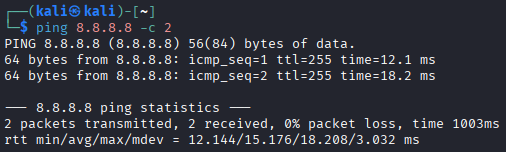

# Introduktion til faget og opsætning af værktøjer

??? note "Læringsmål"
    Overordnede læringsmål fra studie ordningen
    
    Den studerende har viden om og forståelse for:

    - Grundlæggende netværksprotokoller
    - Sikkerhedsniveau i de mest anvendte netværksprotokoller

    Den studerende kan supportere løsning af sikkerhedsarbejde ved at:

    - Opsætte et simpelt netværk

    Læringsmål den studerende kan bruge til selvvurdering

    - Den studerende kender fagets læringsmål og fagets semester indhold
    - Den studerende kan vurdere egne faglige evner i relation til fagets læringsmål
    - Den studerende har viden om virtuelle maskiner
    - Den studerende har viden om VPN opsætning

??? note "Praktiske mål"

    - Spørgeskema om forudsætninger udfyldt
    - Virtualbox installeret
    - Kali Linux VM installeret i virtualbox
    - Alle studerende har forbindelse til TryHackMe via Kali/VPN
    - THM Linux fundamentals part 1+2+3 gennemført

??? note "Forberedelse"
    Læs lektionsplanen og øvelser

    Læs kapitel 1 – it-kriminalitet og trusler fra cyberspace, i “IT Sikkerhed i praksis”

    Download seneste kali linux image til virtualbox 

## Opgave - Studieordning og læringsmål

??? note "Opgave beskrivelse"
    1. Dan dig et overblik over hvad der står i "[Studieordning National](https://esdhweb.ucl.dk/D22-1980440.pdf)", hvad indeholder den og hvad står under de forskellige sektioner. Noter de spørgsmål du har til den nationale studieordning. 10 minutter
    2. Dan dig et overblik over hvad der står i "[Studieordning Institutionel del 2022](https://esdhweb.ucl.dk/D25-2974166.pdf) (først gældende fra 1.feb)", hvad indeholder den og hvad står under de forskellige sektioner. Noter de spørgsmål du har til den Institutionel del af studieordningen. 10 minutter
    3. Læs læringsmålene for "Introduktion til IT Sikkerhed" i studieordningen - Noter de spørgsmål du har til læringsmålene. 10 minutter
    4. Læs om "Prøve i Introduktion til IT-sikkerhed", Noter spørgsmål til indholdet. 5 minutter
    5. Opsamling på klassen baseret på jeres spørgsmål. 10 minutter

Fremgangsmåde:

1. Det indeholder læringsmål for alle fag, info om praktik, og krav til bachelorprojektet.
2. Det indeholder faglige mål på uddannelsen, prøver på uddannelsen, undervisnings former og studie støttende rammer.
3. Jeg har umiddelbart ikke nogle spørgsmål. Jeg synes alle læringsmålene inden for dette fag er meget fornuftige. Bortset fra "Håndtere mindre scripting programmer set ud fra et it-sikkerhedsmæssigt perspektiv" under færdigheder. Hvad betyder it-sikkerhedsmæssigt perspektiv? Det kunne være at man laver noget offensivt script som prøver at udnytte noget, eller noget der skal opfange fejl.

## Opgave - Kali Linux virtuel maskine i Virtualbox

??? note "Opgave beskrivelse"
    1. Download Virtualbox [https://www.virtualbox.org/wiki/Downloads](https://www.virtualbox.org/wiki/Downloads)
    2. Installer Virtualbox [https://www.virtualbox.org/manual/UserManual.html#intro-installing](https://www.virtualbox.org/manual/UserManual.html#intro-installing)
    3. Download Kali Linux til Virtualbox [https://www.kali.org/get-kali/#kali-virtual-machines](https://www.kali.org/get-kali/#kali-virtual-machines)
    4. Importer Kali Linux ved hjælp af denne guide [https://www.kali.org/docs/virtualization/import-premade-virtualbox/](https://www.kali.org/docs/virtualization/import-premade-virtualbox/)
    5. Start Kali Linux VM og log ind, Default credentials er kali:kali (user:pass)
    6. Åbn en terminal og ping 8.8.8.8 for at sikre at du har forbindelse til internettet

Fremgangsmåde:

1. Jeg starter med at installere virtualbox og kali linux.
2. Efter download åbner jeg virtualbox, og unzipper den downloadede kali linux fil.
3. Inde i virtualbox klikker jeg på "Open" og vælger "kali-linux-2025.2-virtualbox-amd64.vbox"
4. Min Kali linux virtual machine (VM) er nu klar til at starte, og jeg bruger kali:kali (username:password) for at logge ind.
5. Jeg tester at min VM har internet, hvilket kan ses på følgende billede. Ud fra billedet kan det ses at den modtager packets tilbage, hvilket vil sige at den er forbundet rigtigt fra start.

    

## Opgave - TryHackMe

??? note "Opgave beskrivelse"
    1. Opret en konto på [https://tryhackme.com/](https://tryhackme.com/) - det anbefales at bruge din skole email fordi du kan få rabat [https://help.tryhackme.com/en/articles/6494960-student-discount](https://help.tryhackme.com/en/articles/6494960-student-discount).
    2. Start din Kali Linux VM, hvis du ikke har en så følg Øvelse 24 - Kali Linux virtuel maskine i Virtualbox
    3. Følg guiden fra THM (kræver at du er logget på THM) [https://tryhackme.com/access?o=vpn](https://tryhackme.com/access?o=vpn)
    4. Gennefør rummet Tutorial på THM [https://tryhackme.com/room/tutorial](https://tryhackme.com/room/tutorial) - Husk at du IKKE skal bruge Attackbox fordi du er forbundet via VPN.

Fremgangsmåde

1. Jeg åbnede THM guiden, i min Kali VM og downloadede .ovpn filen.
2. Så updatere jeg Kali med apt: `sudo apt update && sudo apt upgrade -y`
3. Jeg installerede openvpn: `sudo apt install openvpn`
4. For at forbinde til THM's VPN skal man starte openvpn og suplere den med den downloadede fil: `sudo openvpn /Downloads/username.ovpn`
5. Jeg har nu gennemført THM's tutorial room, for at teste  min vpn forbindesle. Jeg i stand til at forbinde til boxen lille website, og fik dette flag: flag{connection_verified}
