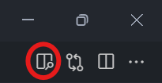

# Dokumentationsteknik med GIT, Gitlab pages og Markdown

!!! note "Overordnede læringsmål fra studie ordningen"

    **Viden**

    Den studerende har viden om og forståelse for:

    - Grundlæggende programmeringsprincipper

    **Færdigheder**

    Den studerende kan supportere løsning af sikkerhedsarbejde ved at:

    - Læse andres scripts samt gennemskue og ændre i dem

    **Kompetencer**

    Den studerende kan:

    - Håndtere mindre scripting programmer set ud fra et it-sikkerhedsmæssigt perspektiv

!!! note "Læringsmål den studerende kan bruge til selvvurdering"

    **Viden**

    Den studerende har viden om og forståelse for:

    - Grundlæggende kryptering - SSH nøgler

    **Færdigheder**

    Den studerende kan supportere løsning af sikkerhedsarbejde ved at:

    - Struktureret dokumentere eget arbejde - Anvende GIT som versionstyringsværktøj

    **Kompetencer**

    Den studerende kan:

    - Offentliggøre dokumentation af eget arbejde ved hjælp af GIT og gitlab pages

!!! note "Forberedelse"

    - Læs undervisningsplanen og øvelser
    - Læs kapitel 3 – Risikoanalyse og risikostyring, i "IT-Sikkerhed i praksis"
    - Læs kapitel 8 – Organisatoriske foranstaltninger, i "IT-Sikkerhed i praksis"

!!! note "Reflektion til forberedelsen"

    - Til kapitel 3: Reflekter over om hvorvidt risikostyring kan og bør dokumenteres?
        - Jeg mener at det vil være svært at dokumentere, men nødvendigt. Nødvendigt da det vil gøre hele processen nemmere, og holde overblik, da de mange aktiver hurtigt løber op.
    - Til kapitel 8: Reflekter over om hvad det er og hvordan det kan og bør dokumenteres?
        - Organisatoriske foranstaltninger, er noget en organisation kan gøre eller ændre for at styrke sikkerheden. Det er en god ide at dokumentere dette, da man så har noget at kigge tilbage på og referere. Det kan være en password politik man skriver ned og dokumentere. Det er godt at have sådan nogle politikker skrevet ned og dokumenteret et centralt sted så alle medarbejdere kan tilgå det, hvis der er tvivl om politikkerne.

## Opgave - Git/gitlab og ssh nøgler

??? note "Opgave beskrivelse"

    Del 1 - git, gitlab og ssh

    Følg denne guide for at opsætte git, gitlab og ssh nøgler [https://npes.gitlab.io/claat-generator/gitlab_daily_workflow/index.html#0](https://npes.gitlab.io/claat-generator/gitlab_daily_workflow/index.html#0) sørg for at klikke på alle links for at få så meget viden som muligt

    Del 2 - ssh user agent

    Som sagt i beskrivelsen til denne øvelse kan du tilgå maskiner og services med ssh hvis du har tilføjet en offentlig ssh nøgle som matcher din private ssh nøgle.
    Det virker fint, men hvad hvis du har brug for at tilgå en 3. maskine, med ssh, fra den 2. maskine?
    Det vil ikke virke med mindre din private ssh nøgle er på den 2. maskine, men det er som sagt ikke en god ide at have din private nøgle andre steder end din private maskine.
    En løsning er at opsætte en ssh user agent og tilføje din private nøgle til agenten. Agenten kan så forwardes til en remote maskine og dermed gøre det muligt at tilgå yderlige maskiner fra den 2. maskine.
    Nå du afslutter din ssh session vil agenten trækkes tilbage og sørge for at din private ssh nøgle ikke er på andre maskiner mere.

    I denne øvelse kommer du ikke længere end fordelen ved at have en user agent og slippe for at skrive dit password igen og igen. Med mindre du har en remote maskine kan du også prøve at forwarde din user agent til den maskine.

    Del 3 - opsæt ssh user agent og autostart

    Åben git bash (eller anden terminal der kan køre git bash)
    Start din user agent eval $(ssh-agent -s)
    Tilføj din ssh nøgle til agenten ssh-add ~/.ssh/id_ed25519
    Opsæt user agent autostart ved at følge denne guide [https://docs.github.com/en/authentication/connecting-to-github-with-ssh/working-with-ssh-key-passphrases#auto-launching-ssh-agent-on-git-for-windows](https://docs.github.com/en/authentication/connecting-to-github-with-ssh/working-with-ssh-key-passphrases#auto-launching-ssh-agent-on-git-for-windows)
    Hvis du ikke har en .bashrc fil, så opret den i roden af din brugers home mappe ~/
    Hvis du ikke opsætter autostart er du nød til manuelt at starte din agent hver gang din maskine genstartes med kommandoen eval $(ssh-agent -s)

    Del 4 - forward ssh user agent

    OBS! Denne del kan kun udføres hvis du har en remote server, raspberry pi eller anden maskine som du kan tilgå via SSH

    Sørg for at din ssh user agent kører, hvis du har fulgt del 3 så burde din user agent starte når du åbner din terminal, hvis ikke så gå tilbage til del 3 og få det til at virke.
    Åben en terminal og ssh til din remote maskine med syntaksen ssh -A user@myhost.com
    myhost.com kan selvfølgelig også være en ip adresse. Brugeren er den bruger du har opsat på din remote maskine.
    -A parametret fortæller ssh at agenten skal forwardes.
    Du kan læse mere om ssh kommando parametre på [https://man.openbsd.org/ssh](https://man.openbsd.org/ssh) eller ved at skrive man ssh hvis du er på linux.
    Fra din remote maskine test at din private nøgle er forwardet ved at verificere med gitlab.com, kør kommandoen `ssh -T git@gitlab.com`

Jeg har lavet det hele i github i stedet for gitlab. For automatisk at deploy det til pages bruger jeg det som ligger i denne fil: [.github/workflows/ci.yml](https://github.com/NoahRosenkjaer/IT-sikkerhed/blob/master/.github/workflows/ci.yml)

Jeg har læst det igennem jeg fandt mest relevant.

## Opgave - Gitlab pages til personlig portfolio

??? note "Opgave beskrivelse"

    1. Lav et projekt på gitlab.com i dit eget namespace https://gitlab.com/DIT_BRUGER_NAVN
    1. Klon projektet til din computer med git clone, brug ssh til at klone projektet :-)
    1. Installer Python og pip, følg mkdocs guiden, stop ved Installing MKDocs https://www.mkdocs.org/user-guide/installation/
    1. Naviger til dit gitlab projekt, åben en terminal og lav et Python virtual environment https://packaging.python.org/guides/installing-using-pip-and-virtual-environments/#creating-a-virtual-environment
    1. Aktiver virtual environment https://packaging.python.org/guides/installing-using-pip-and-virtual-environments/#activating-a-virtual-environment
    1. Følg mkdocs getting started guiden https://www.mkdocs.org/getting-started/ til og med punktet Adding pages
    1. Flyt mappen docs og filen mkdocs.yml til en mappe i dit projekt, navngiv mappen pages
    1. pip freeze gemmer dine ,virtual environment, package dependencies, så dit projekt senere kan genskabes uden en backup af selve pip pakkerne.
    1. Læs om pip freeze https://pip.pypa.io/en/stable/reference/pip_freeze/ og lav en requirements.txt fil ved at køre kommandoen pip freeze > requirements.txt
    1. Kontroller at requirements.txt indeholder dine dependencies, f.eks.

    ``` linenums="0"
    requirements.txt
    text click==7.1.2
    future==0.18.2
    Jinja2==2.11.2
    joblib==0.17.0
    livereload==2.6.3
    lunr==0.5.8 Markdown==3.3.3
    MarkupSafe==1.1.1
    mkdocs==1.1.2
    nltk==3.5
    PyYAML==5.3.1
    regex==2020.11.13
    six==1.15.0
    tornado==6.1
    tqdm==4.53.0
    ```

Jeg kigger på dette hvis det bliver relevant for mig senere.

## Opgave - Markdown

??? note "Opgave beskrivelse"

    1. Læs om markdown og hvad du kan bruge det til https://www.markdownguide.org/getting-started
    1. Kig på markdown syntax i dette cheatsheet https://www.markdownguide.org/cheat-sheet
    1. Undersøg hvordan du kan previewe markdown i din favorit editor.
    1. Lav en test markdown fil .md og prøv mulighederne af ved hjælp af cheat sheetet fra punkt 2 (det kan godt være du skal søge lidt ekstra på nettet for at gøre alt nedenstående)
        - Lav 3 forskellige overskrifter
        - Lav et link
        - Indsæt et billede (link til et billede)
        - Lav en 4*4 tabel med første kolonne venstre justeret, kolonne 2 og 3 centreret og kolonne 4 højre justeret.
        - Lav en unordered list (bullet points) med 3 niveauer
        - Lav en ordered list med 2 niveauer
        - Lav fed tekst og italic tekst. Kan man lave fed italic tekst samtidig ?
        - Lav en code block og angiv det sprog koden er skrevet i.

1. Undersøg hvordan du kan previewe markdown i din favorit editor.
    - Vscode: Man kan bruge `CRTL + SHIFT + V`eller trykke på preview knapen på billedet her under.
        
        

    - Obsidian: Det kan settes til at preview automatisk.

2. Lav en test markdown fil .md og prøv mulighederne af ved hjælp af cheat sheetet fra punkt 2 (det kan godt være du skal søge lidt ekstra på nettet for at gøre alt nedenstående)
    - Lav 3 forskellige overskrifter
        - De kan ses nederst på siden
    - Lav et link
        [Link til undervisers gitlab pages](https://ucl-pba-its.gitlab.io/)
    - Indsæt et billede (link til et billede)
        
    - Lav en 4*4 tabel med første kolonne venstre justeret, kolonne 2 og 3 centreret og kolonne 4 højre justeret.

        |Test|Test|Test|Test|
        |:---|---|---|---:|
        |Test|||Test|
        ||Test|Test||
        |Test|||Test|

    - Lav en unordered list (bullet points) med 3 niveauer
        - Her er en unordered list
            - sub list
                - sub sub list
    - Lav en ordered list med 2 niveauer
        1. Her er en ordered list
            1. Sub list
    - Lav fed tekst og italic tekst. Kan man lave fed italic tekst samtidig?
        - **Fed tekst**
        - *italic tekst* 
        - **_begge dele_**
    - Lav en code block og angiv det sprog koden er skrevet i.
        ```csharp
        Console.WriteLine("Dette er en code block, i C#")
        ```

### Lav 3 forskellige overskrifter

#### Lav 3 forskellige overskrifter

##### Lav 3 forskellige overskrifter
