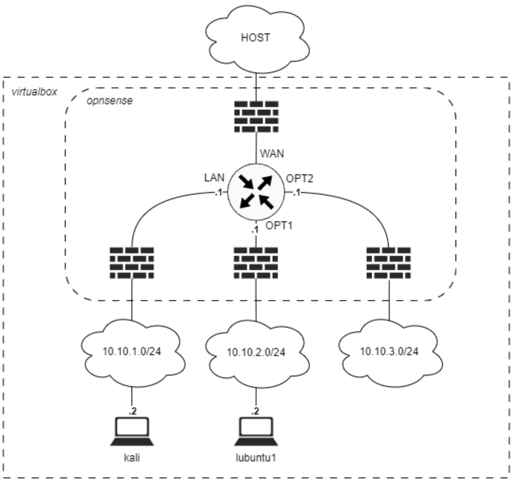
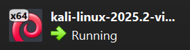
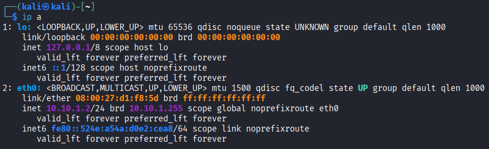
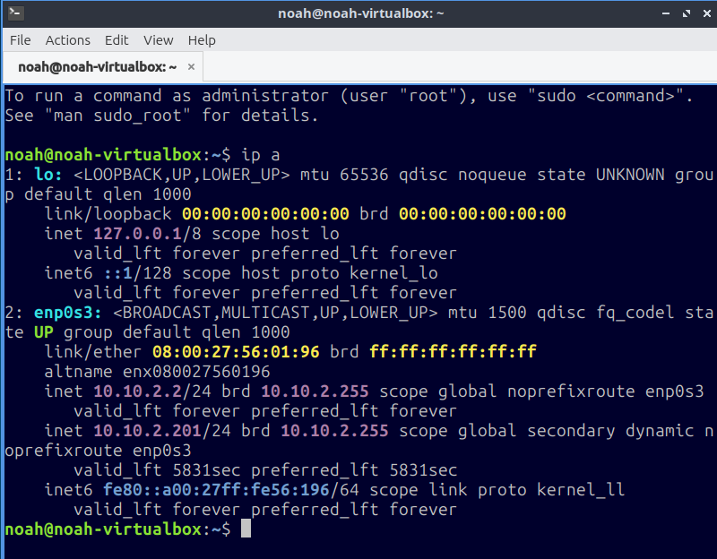
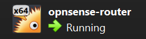
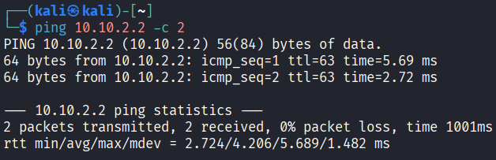
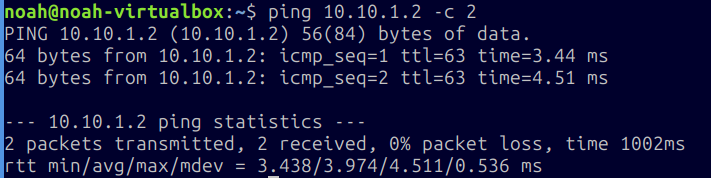

# Sikkerhed i netværksprotokoller

!!! note "Læringsmål der arbejdes med i faget denne uge der arbejdes med i faget denne uge"

    Overordnede læringsmål fra studie ordningen¶

    **Viden**

    Den studerende har viden om og forståelse for:
    - Grundlæggende netværksprotokoller - Sikkerhedsniveau i de mest anvendte netværksprotokoller

    **Færdigheder**

    Den studerende kan supportere løsning af sikkerhedsarbejde ved at:
    - Opsætte et simpelt netværk. - Mestre forskellige netværksanalyse tools

!!! note "Læringsmål den studerende kan bruge til selvvurdering"

    - Den studerende kan anvende nmap til at skanne et netværk og wireshark til at sniffe netværkstrafik
    - Den studerende kan i et virtuelt miljø (virtualbox) opsætte netværksenheder (opnsense og virtuelt netværk) og konfigurere netværk på Linux hosts (lubuntu, kali linux)

!!! note "Forberedelse"

    - Læs undervisningsplanen og øvelser
    - Læs kapitel 4 - Beskyttelse af it-systemer, i "IT-Sikkerhed i praksis", hav fokus på netværk.
    - Se CTF video hvor wireshark bruges https://youtu.be/A4_DOr7Eiqo
    - Se video om hvordan netværkspakker bevæger sig på et netværk How Packets Move Through a Network

## Opgave - Opsætning af virtuelle maskiner i VirtualBox

!!! note "Opgave beskrivelse"

    1. Lav 1 lubuntu VM maskine i VirtualBox, brug seneste stable version af lubuntu som image.
        - hjælp til at installere en ny vm https://www.virtualbox.org/manual/UserManual.html#create-vm-wizard
    2. Importer Kali Linux VirtualBox imaget fra https://www.kali.org/get-kali/#kali-virtual-machines
        - Hjælp til at importere et VM image i VirtualBox https://www.kali.org/docs/virtualization/import-premade-virtualbox/
    3. Konfigurer de 2 virtuelle maskiner's netværk ifølge netværks diagrammet, det vil sige statisk ip konfigureres på begge maskiner med ip adresser fra diagrammet.
        - Hjælp til at konfigurere netværk på en VM i VirtualBox https://www.virtualbox.org/manual/UserManual.html#settings-network

            

1. Lav 1 lubuntu VM maskine i VirtualBox, brug seneste stable version af lubuntu som image.
    - Done

        
2. Importer Kali Linux VirtualBox imaget fra [https://www.kali.org/get-kali/#kali-virtual-machines](https://www.kali.org/get-kali/#kali-virtual-machines)
    - Done

        

3. Konfigurer de 2 virtuelle maskiner's netværk ifølge netværks diagrammet, det vil sige statisk ip konfigureres på begge maskiner med ip adresser fra diagrammet.
    - Done
        - Kali

            
        
        - Lubuntu

            

## Opgave - Opsætning af opnsense virtuel router

!!! note "Opgave beskrivelse"

    1.  download opnsense-its-intro-24.ova fra itslearning
    1.  importer ovf filen i VirtualBox
    1.  åbn indstillinger og bekræft at de 4 netværksinterfaces er konfigureret som nedenstående billede (se også netværks diagram)
    1.  Hvis de ikke er konfigureret så skal du gøre det!
    1. Kontroller at de enkelte netværk er forbundne ved at pinge fra lubuntu maskinen til kali maskinen og fra kali maskinen til lubuntu maskinen.

        Hvis du aldrig har pinget før så start med at læse om hvad og hvordan her:
        https://en.wikipedia.org/wiki/Ping_(networking_utility)
        Spørg derefter en fra din gruppe om de vil vise hvordan man gør, alternativt må du meget gerne spørge din underviser :-)

1. download opnsense-its-intro-24.ova fra itslearning
    - Done
2. importer ovf filen i VirtualBox
    - Done

        

3. åbn indstillinger og bekræft at de 4 netværksinterfaces er konfigureret som nedenstående billede (se også netværks diagram)
    4. Hvis de ikke er konfigureret så skal du gøre det!

        - Det er de.

4. Kontroller at de enkelte netværk er forbundne ved at pinge fra lubuntu maskinen til kali maskinen og fra kali maskinen til lubuntu maskinen.

    - Kali kan pinge Lubuntu.
    
        
    
    - Lubuntu kan pinge Kali linux.

        

## Opgave - Udforskning af opnsense cli og webinterface

!!! note "Opgave beskrivelse"

    1. Log på CLI og kontroller at interfaces og netværks adresser stemmer overens med netværksdiagrammet.
        - Noter WAN adressen
        - Hvis noget ikke stemmer overens så fejlsøg (husk at spørge om hjælp)
        - Hvis der er noget du ikke forstår, så spørg om hjælp!
        - Når du forstår diagram og CLI interface informationen så fortsæt til næste trin.

    2. Log på web interfacet og gennemgå dokumentationen for opnsense på https://docs.opnsense.org/ samtidig med at i finder tingene på jeres opnsense installation i virtualbox.
    Besvar følgende og dokumenter på gitlab pages:
        - Hvilke features tilbyder opnsense?
        - Hvordan kan du kontrollere om din opnsense version har kendte sårbarheder?
        - Hvad er lobby og hvad kan man gøre derfra?
        - Kan man se netflow data direkte i opnsense og i så fald hvor kan man se det?
        - Hvad kan man se omkring trafik i Reporting?
        - Hvor oprettes vlan's og hvilken IEEE standard anvendes?
        - Er der konfigureret nogle firewall regler for jeres interfaces (LAN og WAN)? Hvis ja, hvilke?
        - Hvilke slags VPN understøtter opnsense?
        - Hvilket IDS indeholder opnsense?
        - Hvor kan man installere os-theme-cicada i opnsense?
        - Hvordan opdaterer man firmware på opnsense?
        - Hvad er nyeste version af opnsense?
        - Er jeres opnsense nyeste version? Hvis ikke så opdater den til nyeste version :-)

1. Log på CLI og kontroller at interfaces og netværks adresser stemmer overens med netværksdiagrammet.
    - Noter WAN adressen
        - `v4/DHCP4: 10.0.2.15/27`
        - `v6/DHCP6: fd17:625c:f037:2:a00:27ff:fecb:ac/64`

2. Log på web interfacet og gennemgå dokumentationen for opnsense på https://docs.opnsense.org/ samtidig med at i finder tingene på jeres opnsense installation i virtualbox.
Besvar følgende og dokumenter på gitlab pages:
    - Hvilke features tilbyder opnsense?
        - Lobby
        - Reporting
        - System
        - Interfaces
        - Firewall
        - VPN
        - Services
        - Power
        - Help
    - Hvordan kan du kontrollere om din opnsense version har kendte sårbarheder?
        - Man gå ind på [cvedetails.com](https://www.cvedetails.com/vulnerability-list/vendor_id-21847/Opnsense.html) og se sårbarheder for en given udgiver.
    - Hvad er lobby og hvad kan man gøre derfra?
        - Man kan åbne 4 sub fetures:
            - Dashboard: Et dashboard til at overse system informationer, services der køre, gateways, og interfaces.
            - License: Til at se det license som OPNsense bruger.
            - Password: Til at lave et nyt password.
            - Logout: Giver sig selv
    - Kan man se netflow data direkte i opnsense og i så fald hvor kan man se det?
        - I Reporting/NetFlows
    - Hvad kan man se omkring trafik i Reporting?
        - Man kan se diagrammer i forhold til netwærks trafik.
    - Hvor oprettes vlan's og hvilken IEEE standard anvendes?
        - Under Interfaces/Other types/VLAN, og den bruger 802.1Q
    - Er der konfigureret nogle firewall regler for jeres interfaces (LAN og WAN)? Hvis ja, hvilke?
        - WAN: Den blokere alt der kommer ude fra.
        - Lan: Først bliver alt IPv4 der kommer ind på  port 53 dette interface tilladt, Hvis noget trafik ikke padser på dette, så bliver alt tilladt.
    - Hvilke slags VPN understøtter opnsense?
        - IPsec
        - OpenVPN
        - WireGuard
    - Hvilket IDS indeholder opnsense?
        - Suricata
    - Hvor kan man installere os-theme-cicada i opnsense?
        - System/Firmware/plugins
    - Hvordan opdaterer man firmware på opnsense?
        - Åben System/Firmware/status, så tryk på check for updates. Den tager dig så til System/Firmware/updates, og den bedere dig reboote hvis den finder noget. efter reboot, kan man trykke på update.
    - Hvad er nyeste version af opnsense?
        - 25.7