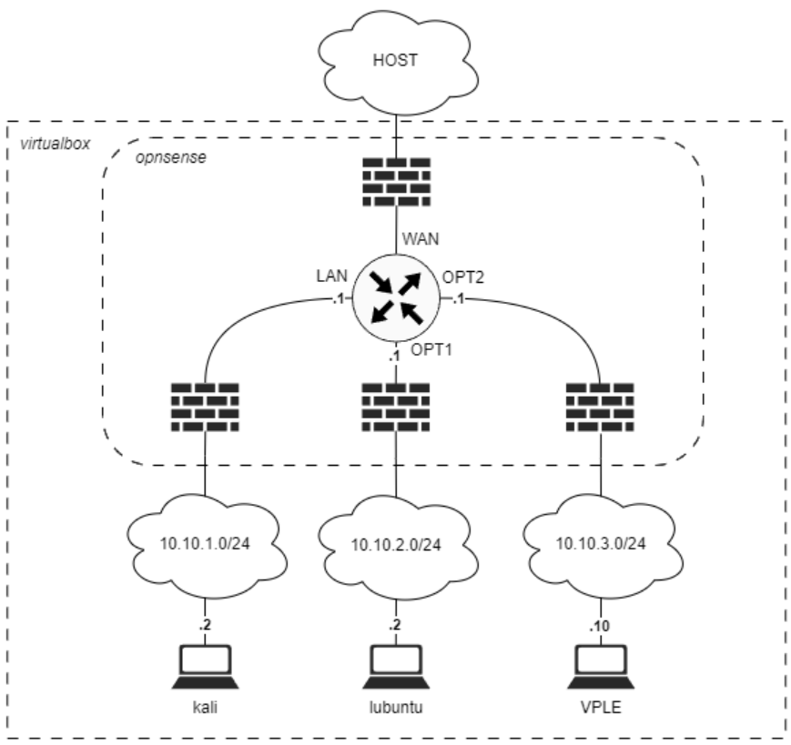
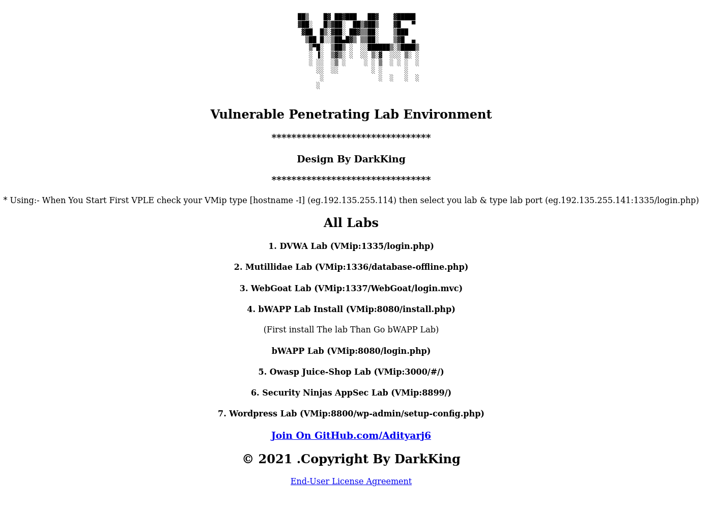
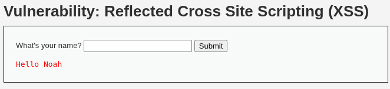
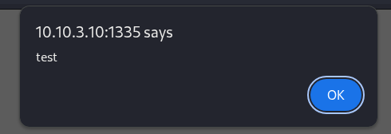
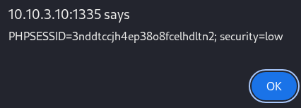
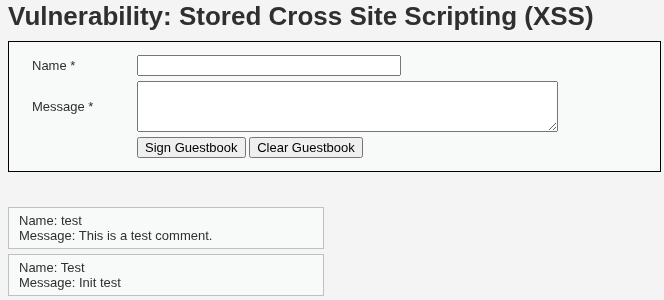
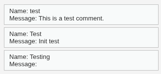

# Netværksanalyse

!!! note "Læringsmål der arbejdes med i faget denne uge der arbejdes med i faget denne uge"

    Overordnede læringsmål fra studie ordningen

    **Viden**

    Den studerende har viden om og forståelse for:
    - Grundlæggende netværksprotokoller - Sikkerhedsniveau i de mest anvendte netværksprotokoller

    **Færdigheder**

    Den studerende kan supportere løsning af sikkerhedsarbejde ved at:
    - Opsætte et simpelt netværk

!!! note "Læringsmål den studerende kan bruge til selvvurdering"

    - Den studerende har kendskab til begreber og værktøjer der anvendes i forbindelse med offensivt sikkerhedsarbejde.
    - Den studerende kan forklare grundlæggende netværk, herunder protokoller, routere, switche osv.
    - Den studerende kan opsætte og konfigurere et simpelt netvæksmiljø der kan anvendes til at afprøve offensive sikkerhedsværktøjer.

!!! note "Praktiske mål"

    - Øvelser fuldført
    - Et par af øvelserne til DVWA afprøvet - det er også ok at lave øvelser fra de andre services på DVWA.

!!! note "Forberedelse"

    - Læs kapitel 7 – Hacking og penetration testing med Kali Linux, i "IT-Sikkerhed i praksis"
    - Se video om [network security vulnerabilities](https://www.youtube.com/watch?v=2VaPTIuRs4k)

## Opgave - Vulnerable Pentesting Lab Environment

??? note "Opgave beskrivelse"


    1. Hent VPLE VM [https://www.vulnhub.com/entry/vulnerable-pentesting-lab-environment-1,737/](https://www.vulnhub.com/entry/vulnerable-pentesting-lab-environment-1,737/)
    2. Åbn maskinen i virtualbox [https://www.kali.org/docs/virtualization/import-premade-virtualbox/](https://www.kali.org/docs/virtualization/import-premade-virtualbox/)
        Hvis du ikke kan importere filen har Benny lavet en guide i E24 [Bennys guide til VPLE](https://bennyn86.gitlab.io/myportfolio/IT-Sikkerhed/Uge%2039%20-%20Netv%C3%A6rksanalyse/)
        Alternativt kan du hente den VPLE.ova fil jeg har lavet som også virker på virtualbox, den er på itslearning (men det er sejere at bruge Bennys guide!)
    3. Start VPLE maskinen i virtualbox.
    4. Ret VPLE maskinens netværks konfiguration til det interne virtualbox netværk (intnet) som hører til OPT2 interfacet - se netværksdiagrammet hvis du er i tvivl.
    5. VPLE maskinen henter en IP via DHCP hvilket ikke er konfigureret på opnsense routeren, derfor skal der konfigureres en statisk ip på VPLE maskinen.
    6. Åbn en terminal til VPLE maskinen og find IP adressen med `hostname -I` - her finder du kun `172.17.0.1`. Der burder være 2 adresser, så der mangler en addresse til netværket.
        - TIP keyboard layoutet er sat til noget andet end dansk, du kan skrive `sudo loadkeys dk` for at skifte til dansk layout.
    7. Find dit netværksinterfacenavn med `ip link | grep ens` (mit hedder ens33)
    8. Åbn VPLE maskinens netværks konfiguration med
    `sudo nano /etc/netplan/01-netcfg.yaml`.
    9. Rediger filens indhold så det ser ud som nedenstående (ret ens33 hvis dit interface hedder noget andet):

        ```yaml linenums="0"
        network:
        version: 2
        renderer: networkd
        ethernets:
        ens33:
        dhcp4: no
        addresses:
            - 10.10.3.10/24
        gateway4: 10.10.3.1
        ```

    10. Afslut nano med `ctrl+s` og derefter `ctrl+x`
    11. Indlæs den nye configuration med `sudo netplan apply`
    12. Kontroller at du har den korrekte ip addresse med `ip a | grep ens` og at du kan pinge routerens interface (OPT2, se netværks diagram for ip) Fejlfind hvis det ikke virker
    13. Gå til din kali maskine, åbn en browser og naviger til VPLE maskinens ip, her burde du få en velkomst side der viser adresser til de forskellige labs Fejlfind hvis det ikke virker
    14. Gå til DVWA og prøv et par øvelser fra [https://github.com/mrudnitsky/dvwa-guide-2019](https://github.com/mrudnitsky/dvwa-guide-2019) Fejlfind hvis det ikke virker
    15. Udforsk de øvrige labs når du har tid og lyst fremover. Husk at dokumentere dine erfaringer på gitlab når du laver labs, det hjælper ved fejlfinding og fordrer dybdelæring.

Netværket kommer til at se sådan ud

*Netværks diagram*

Jeg har sat det hele op, men jeg havde problemer da det yaml som `/etc/netplan/01-netccfg.yaml` skulle ændres til, ikke er indenteret ordenligt.

Her er den korrekte indentering:

```yaml linenums="0"
network:
    version: 2
    renderer: networkd
    ethernets:
        ens33:
            dhcp4: no
            addresses:
                - 10.10.3.10/24
            gateway4: 10.10.3.1
```

Efter at starte kali maskinen op, så kan jeg gå til VPLE maskinens ip, og får dette resultat.



Jeg vil så gå i gang med nogle af DVWA opgaverne.

## Opgave - DVWA opgaver

!!! note "Opgave beskrivelse"

    Jeg vil hente hjælp ved denne [Guide](https://github.com/keewenaw/dvwa-guide-2019) hvis jeg sidder fast.

### DVWA Opgave - Vulnerability: Reflected Cross Site Scripting (XSS)

Denne sårbarhed er en cross site scripting (XSS) sårberhed. "reflected" betyder at det man skriver bliver vist på siden på den ene eller den anden måde. 


Den viser hvad end man skriver i feltet.

Jeg prøver at skrive `<script>alert("test")</script>` hvilket virker perfekt.



Grunden til dette virker er at alt der bliver skrevet i fltet bliver reflekteret direkte i HTML.

Når jeg skriver mit navn i feltet så kommer sidens HTML til at se sådan ud. `<pre>Hello Noah</pre>`. Da der ikke er nogen form for validering eller sanitering af det bruger supleret input, så kan man også skrive HTML, og dermed og så Java script.

Jeg prøver som sagt før at bruge `<script>alert("test")</script>`,
Hvilket får sidens HTML til at se sådan ud: `<pre>Hello <script>alert("test")</script></pre>`. Her nester jeg nogle `<script>` tags inde i `<pre>` tags. Script tags gør at man kan køre java script direkte inde i sidens HTML. Jeg køre så `alert("Test")` som får siden til at køre en alert funktion.

Jeg kan ændre mit payload lidt og vise min session cookie.
`<script>alert(document.cookie)</script>`


### DVWA Opgave - Vulnerability: Stored Cross Site Scripting (XSS)

Dett er også Cross Site Scripting, men det er en anden version eller type. Stored XSS betyder at det man skriver, bliver gemt. Det kunne være at men bruger customer supoprt, og sender en ticket, som så bliver gemt på firmaets support side. Den er så gemt indtil en supporter åbner din ticket, hvor hvad end Java script payload venter på at bliver eksikveret i deres browser.



Eksemplet er en guestbook, hvor alt man sender bliver gemt. hvis man reloader siden kan man stadig se mit "init test".

Jeg prøver at give den det samme payload fra sidste opgave: `<script>alert(document.cookie)</script>`

Dette virker som den giver mig min session cookie i en alert.


Efter man trykker på "OK" så kan man se at det payload ikke bliver vist, efter koden blev kørt, ved "Testing"



Nu bliver koden kørt igen og igen, hver gang man åbner den side.
