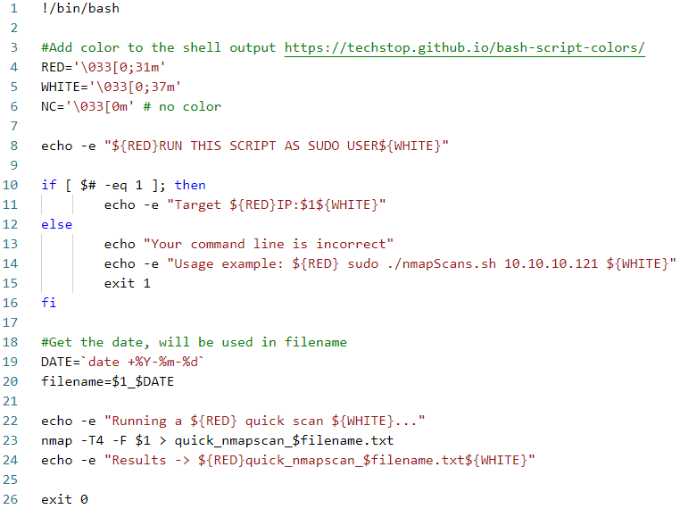

# Scripting - Bash og powershell

!!! note "Overordnede læringsmål fra studie ordningen"

    **Viden**

    Den studerende har viden om og forståelse for:
    
    - Grundlæggende programmeringsprincipper

    **Færdigheder**

    Den studerende kan supportere løsning af sikkerhedsarbejde ved at:
    
    - Anvende primitive og abstrakte datatyper - Læse andres scripts samt gennemskue og ændre i dem

    **Kompetencer**

    Den studerende kan:
    
    - Håndtere mindre scripting programmer set ud fra et it-sikkerhedsmæssigt perspektiv

!!! note "Læringsmål den studerende kan bruge til selvvurdering"

    - Den studerende ved hvad scripting i hhv. Bash og Powershell er
    - Den studerende kan forstå og implementere et simpelt bash script, samt omskrive det til et powershell script med samme funktionalitet
    - Den studerende kan anvende variabler, CLI parametre, kontrolstrukturer og løkker i forbindelse med bash og powershell scripts

!!! note "Forberedelse"

    - Læs undervisningsplanen og øvelser
    - Læs kapitel 6 – Praktisk kryptografi, i "IT-Sikkerhed i praksis".
    - Se video om Bash Scripting [Nullbyte: Write Your Own Bash Scripts for Automation](https://youtu.be/PPQ8m8xQAs8)
    - Se video om Powershell [John Hammond: PowerShell playliste](https://youtube.com/playlist?list=PL1H1sBF1VAKXqO_N3ZNP0aL15miJcUhw7)

## Opgave - THM: Bash scripting

Jeg gennem gik TryHackMe's [bash room](https://tryhackme.com/room/bashscripting)

Det kan ses [her](https://tryhackme.com/p/Tictac00)

## Opgave - Forstå bash script + tilrette script

!!! note "Opgave beskrivelse"

    1. Diskuter nedenstående script med dit team. Hvad sker der på hver linje i dette script? – I skal snakke det igennem FØR I kører koden. Ideen er at forstå koden.

    2. Implementer dette script i din linux VM. Når du har fået det til at virke, så tilret således nmap resultatet ikke skrives til en fil, men at alle de åbne porte printes direkte i konsolvinduet (uden anden output).

        


1. Hvad gør koden?
    - Linje 1: er et shbang som forteller scriptet at det skal køre med bash.
    - Linje 4-6: Der bliver defineret nogle farver som senere bliver brugt i `echo` outputs.
    - Linje 8: her bliver det brugt en `echo` kommando med flaget `-e` som betyder `-e  enable interpretation of backslash escapes`. Det skal bruges for at få farven til at virke. Inde i den string som skal outputtes kalder man variablerne `$(red)` og `$(white)`, Det er sådan det bliver farvet. alt efter en valgt farve bliver den farve, ind til en ny farve bliver defineret.
    - Linje 10: Der bliver tjekket om alle agrumenterne til sammen er 1, hvis ja printer den `Target IP: XXX.XXX.XXX.XXX`. Hvis ikke betyder det at dette script blev kørt uden at give et argiment, og derfor printer den hvordan man skal bruge scriptet.
    - Linje 19: definer en dato.
    - Linje 20: `filename` er lig med ip adressen som givet i argumentet, plus datoen.
    - Linje 22: print til terminal
    - Linje 23: kør en nmap scanning, med flagene `-F: Fast mode - Scan fewer ports than the default scan` og `-T<0-5>: Set timing template (higher is faster)` Det bliver så skrevet til en fil.
    - Linje 26: programmet stopper sig selv.
2. Implementer dette script i din linux VM. Når du har fået det til at virke, så tilret således nmap resultatet ikke skrives til en fil, men at alle de åbne porte printes direkte i konsolvinduet (uden anden output).
    - Først så er der fejl i koden. Linje 19 med date skal se sådan ud `DATE=$(date +%Y-%m-%d)` Dette vil gøre at komandoen date bliver kørt og dets output gemt i variablet `DATE`. Ellers ville det bare være en string. Jeg har skrevet koden uden alt det med farver.

        ```bash
        #!/bin/bash

        set -x

        echo "RUN THIS SCRIPT AS A SUDO USER"

        if [ $# -eq 1 ]; then
                echo "Target IP: $1"
        else
                echo "Your command line is incorrect"
                echo "Usage example: sudo ./nmapscan.sh 10.10.10.40"
                exit 1
        fi

        DATE=date +%Y-%m-%d
        filename="$1_$DATE.txt"
        touch $filename
        echo "Running a quick scan..."
        nmap -T4 -F $1 > "$filename"
        echo "Look in $filename"

        exit 1
        ```

        Resultatet fra output filen `10.10.2.2_2025-10-08.txt`

        ```text linenums="0"
        Starting Nmap 7.95 ( https://nmap.org ) at 2025-10-08 04:12 EDT
        Nmap scan report for 10.10.3.10
        Host is up (0.046s latency).
        Not shown: 996 closed tcp ports (reset)
        PORT     STATE SERVICE
        80/tcp   open  http
        3000/tcp open  ppp
        8800/tcp open  sunwebadmin
        8899/tcp open  ospf-lite

        Nmap done: 1 IP address (1 host up) scanned in 0.91 seconds
        ```

    - Her bruger jeg `printf`, `awk` og `cut` til at manipulere outputtet fra nmap. `printf` er en måde at printe "pænt" virker lige som `echo`. Jeg printer så outputtet fra `nmap` piper det ind i `awk`, som kigger efter `/tcp`, derefter printer den så den første del som matcher, hvilket er alt til og med `/tcp` på en linje (Hvis en linje ikke har `/tcp` så bliver den sorteret fra). Jeg bruger så `cut` med `-d/` som betyder at den splitter linjen ved et `/` og `-f1` betyder at den skal printe de første del, som så er port nummeret.

        ```bash
        #!/bin/bash

        output=$(nmap $1)


        printf '%s\n' "$output" | awk '/\/tcp/ {print $1}' | cut -d/ -f1

        exit 1

        ```

        Dets output ser sådan ud:

        ```text linenums="0"
        80
        3000
        8800
        8899

        ```

## Opgave - Powershell basics

!!! note "Opgave beskrivelse"

    1. Lav så meget som muligt af Automate administrative tasks by using PowerShell https://docs.microsoft.com/en-us/learn/paths/powershell/
    1. Dan dig et overblik over hvad du kan finde i den officielle dokumentation https://docs.microsoft.com/en-us/powershell/scripting/how-to-use-docs?view=powershell-7.2

Man kan finde den officielle dokumentation [her](https://learn.microsoft.com/en-us/powershell/). Ellers så søg på nettet, brug stackoverflow og andre ligende sider.