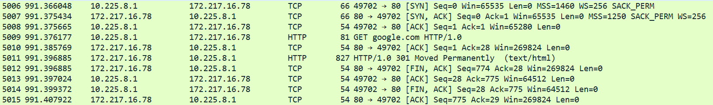

# Python programmering med netværk

!!! note "Læringsmål"

    **Færdigheder**

    Den studerende kan supportere løsning af sikkerhedsarbejde ved at:
    - Konstruere simple programmer der kan bruge netværk - Konstruere og anvende tools til f.eks. at opsnappe samt filtrere netværkstrafik

    **Kompetencer**

    Den studerende kan:
    - Håndtere mindre scripting programmer set ud fra et it-sikkerhedsmæssigt perspektiv

    Læringsmål den studerende kan bruge til selvvurdering

    - Den studerende kan anvende Python til at kommunikere via netværksprotokoller, herunder TCP og HTTP.
    - Den studerende kan anvende Python til at analysere netværkstrafik ved hjælp af TShark

!!! note "Forberedelse"

    - Læs undervisningsplanen og øvelser
    - Læs kapitel 9 – Information Security Management Systems (ISMS), i "IT-Sikkerhed i praksis"

## Opgave - Python netværks programmering

??? note "Opgave beskrivelse"


    1. Fork projektet [https://gitlab.com/npes-py-experiments/network-programs](https://gitlab.com/npes-py-experiments/network-programs) til dit eget gitlab namespace
    1. Klon projektet til din computer
    1. Lav et virtual environment og installer dependencies som beskrevet i readme.md filen [https://gitlab.com/npes-py-experiments/network-programs#development-usage](https://gitlab.com/npes-py-experiments/network-programs#development-usage)

    **socket**

    1. Læs om pythons socket bibliotek [https://docs.python.org/3/library/socket.html](https://docs.python.org/3/library/socket.html)
    1. Læs koden i socket_1.py Hvad gør koden og hvordan bruger den socket biblioteket?
    1. Kør koden med default url og observer hvad der sker, du kan også prøve at single steppe filen for at kunne følge med i variabler osv. [https://python.land/creating-python-programs/python-in-vscode](https://python.land/creating-python-programs/python-in-vscode)
    1. Åben wireshark (installer det hvis du ikke allerede har det)
    1. Kør koden igen med default url, analyser med wireshark og besvar følgende:
        - Hvad er destinations ip ?
        - Hvilke protokoller benyttes ?
        - Hvilken content-type bruges i http header ?
        - Er data krypteret ?
        - Hvilken side hentes ?
    1. Læs socket_2.py og undersøg hvordan linje 38 - 47 kan tælle antal modtagne karakterer
    1. Kør socket_2.py og prøv at hente forskellige url's der benytter https, hvad modtager du, hvilken http response får du, hvad betyder de og er de krypteret ?
    1. Gentag trin 7 og analyser med wireshark for at finde de samme informationer der
    1. Åben socket_3.py, analyser koden og omskriv den så kun http headers udskrives.

    **urllib**

    1. Læs om urllib biblioteket [https://docs.python.org/3/library/urllib.html](https://docs.python.org/3/library/urllib.html)
    1. Åbn urllib_1.py og læs koden, hvordan er syntaksen ifht. socket 1-3 programmerne ?
    1. Hvilket datasvar får du retur hvis du prøver at hente via https, f.eks [https://docs.python.org/3/library/urllib.html](https://docs.python.org/3/library/urllib.html)
    1. Kør programmet igen med [https://docs.python.org/3/library/urllib.html](https://docs.python.org/3/library/urllib.html) og analyser i wireshark, besvar følgende:
        - Hvad er destinations ip ?
        - Hvilke protokoller benyttes ?
        - Hvilken content-type bruges i http(s) header ?
        - Er data krypteret ?
        - Hvor mange cipher suites tilbydes i Client hello ?
        - Hvilken TLS version og cipher suite bliver valgt i Server Hello ?

    **BeautifulSoup**

    1. Læs om BeatifulSoup biblioteket [https://beautiful-soup-4.readthedocs.io/en/latest/](https://beautiful-soup-4.readthedocs.io/en/latest/)
    1. Hvad er formået med biblioteket ?
    1. Åbn urllib_2.py og analyser koden for at finde ud af hvad den gør.
    1. Kør programmet
    1. Ret i programmet så det tæller et andet HTML tag
    1. Ret i programmet så det bruger BeatifulSoups .findall() metode

    **Feedparser**

    1. Læs om feedparser biblioteket [https://feedparser.readthedocs.io/en/latest/](https://feedparser.readthedocs.io/en/latest/)
    1. Åbn rssfeed_parse.py og analyser koden for at finde ud af hvad den gør.
    1. Linje 28, som formatterer modtaget data, har en meget lang sætning.
    
        rssfeed_parse.py
        ```python
        f'# {entry.title}\n**_Author: {entry.author}_**  \nPublished:  {entry.published}  \n**_Summary_**  \n{re.sub(r"[^a-zA-Z0-9]", " ", entry.summary).replace(" adsense ", " ").replace(" lt ", " ").replace(" gt ", " ")}  \n  \nLink to full article:  \n[{entry.link}]({entry.link})\n'
        ```
        Hvad gør den ? ( du kan prøve at erstatte den med {entry.summary} for at se forskellen)
    1. Find et passende sikkerheds relateret rss feed, på internettet, du vil parse.
    1. Omskriv `rssfeed_parse.py` til at bruge dit valgte feed, ret i formatteringen, så du får et output i markdown filen, der svarer til:

        ```python
        # Headline/title

        **_Author:_**
        **_Summary:_**
        [link_to_full_article](link_to_full_article)
        ```


Jeg starter med at lave en fork af det repo [https://gitlab.com/npes-py-experiments/network-programs](https://gitlab.com/npes-py-experiments/network-programs), og derefter klone det til min pc.
Så lavede jeg et virtual envirenment med python, og installerede alle de brugte dependecies med `pip install -r requirements.txt`

**socket**

`socket_1.py` laver en simpel `GET` request til en given hjemmeside.
Jeg analysere det så med wireshark.


- Hvad er destinations ip ?
    - Destination Address: 146.190.62.39
- Hvilke protokoller benyttes ?
    - HTTP
- Hvilken content-type bruges i http header ?
    - text/html
- Er data krypteret ?
    - Nej
- Hvilken side hentes ?
    - http://httpforever.com/

`socket_2.py` modtager content som en string, den looper så over det hele bogstav for bogstav.



Jeg modtager `HTTP/1.0 301 Moved Permanently` og der er ikke kryptering da, programmet laver en `GET` request med HTTP. Men google flytter mig så til en HTTPS veriosn af siden.

Her er den opdateret kode:

```python
import socket

mysock = socket.socket(socket.AF_INET, socket.SOCK_STREAM)
mysock.connect(('data.pr4e.org', 80))
cmd = 'GET http://data.pr4e.org/intro-short.txt HTTP/1.0\r\n\r\n'.encode()
mysock.send(cmd)

received =b"" #Stores recieved data in bytes

while True:
    data = mysock.recv(512)
    if len(data) < 1:
        break
    received += data
headers = received.split(b"\r\n\r\n")
print(headers[0].decode())
mysock.close()
```

Her er resultatet:

```terminal linenums="0"
HTTP/1.1 200 OK
Date: Wed, 29 Oct 2025 10:07:00 GMT
Server: Apache/2.4.52 (Ubuntu)
Last-Modified: Sat, 13 May 2017 11:22:22 GMT
ETag: "1d3-54f6609240717"
Accept-Ranges: bytes
Content-Length: 467
Cache-Control: max-age=0, no-cache, no-store, must-revalidate
Pragma: no-cache
Expires: Wed, 11 Jan 1984 05:00:00 GMT
Connection: close
Content-Type: text/plain
```

Jeg har tideligere arbejdet med socket, da jeg har lavet mig selv en lille [key logger](https://github.com/NoahRosenkjaer/Keylogger) i python.