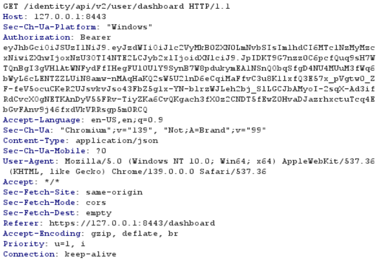
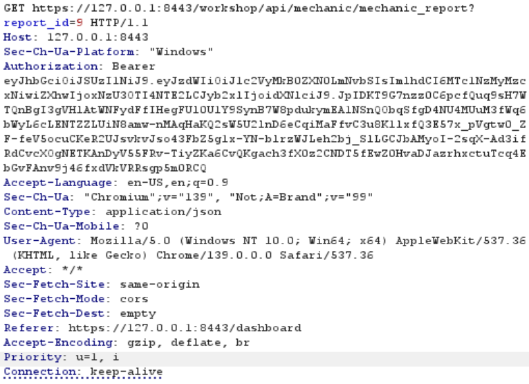
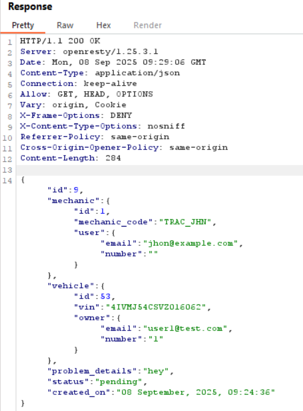

# Sårbarheder i API'er

!!! note "Praktiske mål"

    - Hver studerende har anvendt BURP suite til at analyser forspørgelser fra en web applikation.
    - Hver studerende har identificeret en simpel BOLA sårbarhed.
    - Hver studerende har identificeret en simpel Excessive data exposure sårbarhed.

!!! note "Læringsmål"

    **Viden**

    - teorier, metoder og praksis relateret til webapplikationssikkerhed, herunder principper for sikring af API’er.
    - typiske trusler og sårbarheder forbundet med webapplikationer og deres årsager
    - metoder til vurdering og efterprøvning af sikkerhedsmæssige foranstaltninger.

    **færdigheder**

    - anvende metoder til at identificere og analysere sikkerhedsmæssige svagheder i webapplikationer
    - tolke og vurdere testresultater i forhold til kendte sikkerhedsprincipper

!!! note "Forberedelse"

    - Skim læs kapitel 0 i bogen "Hacking APIs"
    - Læs kapitel 3 i bogen "Hacking APIs"

??? note "Reflektions punkter efter forberedelsen"

    **Kapitel 0**:

    - Hvad er en trusselsaktør?
        - En trusselsaktør er den som angriber API'en eller applikation.  Trusselsaktøren kan være alle, lige fra en random person, til en insider der ved næsten alt om applikationen.
    - hvad menes der med black,grey & whitebox testing?
        - Blackbox testing er når man som pen-tester kun kender firmaet man skal teste, og det eneste information man får er måske en IP adresse. Her fra skal man så lave rekognoscering, for at finde information om målet.
        - Graybox testing er når man får givet mere information, såsom hvad man må og ikke må teste (In and out of scope), adgang til API dokumentationen og så videre. I graybox testing skipper man rekognoscering, så der kan bruges mere tid på at teste applikationen eller API'en. Typisk falder bug bounty ind i mellem balck og graybox, da man får givet et scope, man skal stadig lave rekognoscering.
        - Whitebox testing er når klienten giver så meget information og adgang til pen-testeren som muligt. Dette kunne være source code adgang, eller adgang til deres software development kit (SDK). Denne metodes formål er at demonstrære en inside attacker.

    **Kapitel 3**:

    - Hvilken information kan du finde på OWASP API top 10 list?
        - OWASP API Security Top 10 er en liste over de mest almene API sårbarheder.
    - Hvad er en BOLA sårbarhed?
        - broken object level authorization (BOLA) sårbarheder, sker når en API ikke ordenligt tjekker om en given bruger er tilladt til at hente resourcer. Det kan være at man henter data om sig selv med sit user id `5000`. Men hvad sker der hvis man så prøver at hente data fra bruger `5001`, hvis man kan det uden at API'en tjekker om man har tilladelse til bruger data for bruger `5001` så er der tale om BOLA. 
    - Excessive data exposure?
        - Excessive data exposure sårbarhed, kan ske når en API svare tilbage med alt det information den har på det ønskede data. Lad os sige at man bruger en API til at få sin egen bruger data, men den også sender bruger data for den bruger der lavede ens egen bruger. Her udstiller API'en en anden bruger uden grund da de sender for meget data. Dette sker oftest når en API forventer at brugere sortere det data fra de ikke skal bruge.

## Opgave - crAPI-system og sikkerhedsmål

!!! note "Opgave beskrivelse"

    - Få indblik i den grundlæggende anvendelse af crAPI ved at følge denne [guide](https://github.com/mesn1985/WebApplicationSecurityBasicsLab/blob/main/crAPI/1_Getting_To_Know_the_Application.md).
    - Identificer systemmål for crAPI (kun webdelen – MailHog kan ignoreres).
    - Udled sikkerhedsmål for hvert af de identificerede systemmål.
    - Identificer mulige angrebsflader ved at tegne en arkitekturskitse over applikationen:
    - Fokuser på de API’er, som kan observeres via browser eller Burp Suite.
    - Da det er en blackbox-analyse, er det kun de API’er, som browseren sender forespørgsler til, der kan inkluderes i skitsen.
    - Antag i denne øvelse, at forskellige root paths (fx /user/api og /workshop/api) indikerer forskellige API’er.
    > (Bemærk: Dette er en forenkling til brug i øvelsen og afspejler ikke nødvendigvis virkeligheden, selvom det ville være god praksis.)

- Identificer systemmål for crAPI (kun webdelen – MailHog kan ignoreres).
    - Man skal kunne lave en bruger
    - Man skal kunne logge ind
    - Den skal kunne sende en mail når man har købt noget.
    - Se detaljer om sin bil.
    - Købe nye dele.
    - Poste i community.
    - Skifte password.
    - Kontakte mekaniker.
- Udled sikkerhedsmål for hvert af de identificerede systemmål.
    - Man skal kunne lave en bruger
        - Ikke bruge en anden brugers mail eller nummer
            - Ikke fortelle brugeren at de gør det.
    - Man skal kunne logge ind
        - Skal rate limit for at undgå brute-force
        - Må ikke vise brugeren at de har bruge en anden brugers mail.
    - Den skal kunne sende en mail når man har købt noget.
        - Man skal ikke kunne manipulere hvor den sender det hen?
    - Se detaljer om sin bil.
        - Man skal ikke kunne se andres biler.
    - Købe nye dele.
        - Man skal ikke kunne manipulere prisen, så det bliver gratis eller koster -10 kr. 
    - Poste i community.
        - Valider og saniter input, så man ikke kan lave XXS.
    - Skifte password.
        - Rate-limit for at undgå brute-force
    - Kontakte mekaniker.
        - Valider og saniter input, så man ikke kan lave XXS.
- Identificer mulige angrebsflader ved at tegne en arkitekturskitse over applikationen:
- Fokuser på de API’er, som kan observeres via browser eller Burp Suite.

- Da det er en blackbox-analyse, er det kun de API’er, som browseren sender forespørgsler til, der kan inkluderes i skitsen.
- Antag i denne øvelse, at forskellige root paths (fx /user/api og /workshop/api) indikerer forskellige API’er.
    > (Bemærk: Dette er en forenkling til brug i øvelsen og afspejler ikke nødvendigvis virkeligheden, selvom det ville være god praksis.)

## Opgave - BOLA & Excessive Data Exposure

!!! note "Opgave beskrivelse"

    - Udfør øvelse: 1 – [BOLA using object IDs without authorization](https://github.com/mesn1985/WebApplicationSecurityBasicsLab/blob/main/crAPI/2_Exploiting_BOLA_And_Excessive_Data_Exposure.md#1--bola-using-object-ids-without-authorization)
    - Udfør øvelse: 2 – [Excessive Data Exposure](https://github.com/mesn1985/WebApplicationSecurityBasicsLab/blob/main/crAPI/2_Exploiting_BOLA_And_Excessive_Data_Exposure.md#2--excessive-data-exposure)
    - Brug resultaterne fra øvelse 1 og 2 til at finde køretøjets placering for en bruger, du ikke selv har oprettet.
    - Udfør øvelse: 3 – [Explore OWASP Application Security Verification Standard](https://github.com/mesn1985/WebApplicationSecurityBasicsLab/blob/main/crAPI/2_Exploiting_BOLA_And_Excessive_Data_Exposure.md#3--explore-owasp-application-security-verification-standard)
    - Husk at notere dine observationer
    - Udfør øvelse: 4 – [Get access to other customers’ mechanic reports](https://github.com/mesn1985/WebApplicationSecurityBasicsLab/blob/main/crAPI/2_Exploiting_BOLA_And_Excessive_Data_Exposure.md#4--access-other-users-mechanic-reports)
    - (Ekstra opgave) Brug [OWASP ZAP’s](https://www.zaproxy.org/) [automatiske scanning](https://www.youtube.com/watch?v=wLfRz7rRsH4) til at finde yderligere sårbarheder.
    Jeg har lavet en guide, som du kan finde [her](https://github.com/mesn1985/WebApplicationSecurityBasicsLab/blob/main/VariousGuides/SetteingUpZedAttackProxy.md)

For at gå igennem dette skal man clone [Web Application Security – Introduction Lab Setup](https://github.com/mesn1985/WebApplicationSecurityBasicsLab/tree/main) med git. starte containerne, og åben siden: [http://127.0.0.1:8888/login](http://127.0.0.1:8888/login)

### Under opgave - BOLA Using Object IDs Without Authorization

!!! note "Opgave beskrivelse"

    1. Create two user accounts — we’ll refer to them as User A and User B.
    1. Register a vehicle for each user. You’ll receive a VIN number and PIN code in the welcome email via MailHog.
    1. While authenticated as User A, navigate to the vehicle details dashboard.
    1. Use Burp Suite to intercept the request made to retrieve the vehicle location data.
    1. Note the resource ID (e.g., vehicle ID) used in the request.
    1. Log out, then authenticate as User B.
    1. Navigate to the same dashboard and capture the equivalent vehicle data request using Burp Suite.
    1. Send User B’s request to the Repeater.
    1. In Repeater, replace User B’s resource ID with the A you captured from User A.
    1. Send the modified request.

Jeg har lavet 2 users (user A, user b) user A har en Mercedes-Benz, og user b har en Audi

Hvis jeg som user A opdatere min bils lokation bliver det sendt en request til en api:
`GET /identity/api/v2/vehicle/7e147d9f-d2f8-432d-899f-429a925198cc/location HTTP/1.1`

Ud fra det kan man se et bil id for user A: `7e147d9f-d2f8-432d-899f-429a925198cc`

Log ind på user b og lav samme request.

Her finder man den user b bil id: `a4c2407f-108a-4115-9d25-60baa0c9ce2e`

Hvis jeg ændre user bs bil id til user A. så bliver lokationen ændret til der hvor user as bil er.

Hvis man bruger repeater til at se den responce siden giver, så kan man også se at infoen er ændret til user a i stedet for user b.

```json
{
  "carId":"7e147d9f-d2f8-432d-899f-429a925198cc",
  "vehicleLocation":{
      "id":5,
      "latitude":"37.406769",
      "longitude":"-94.705528"
  },
  "fullName":"user a",
  "email":"user1@test.com"
}
```

Her ender man med at få givet user as email.

### Under opgave - Excessive Data Exposure

!!! note "Opgave beskrivelse"
    
    - Can you find API responses that return more information than is displayed in the user interface?
    - Do responses include sensitive fields such as internal user IDs, email addresses, roles, or tokens?
    - For example, does a vehicle data endpoint expose fields not shown in the dashboard?

Jeg fandt Excessive Data Exposure på følgende side:
- https://127.0.0.1:8443/forum
    - Her bare man requester siden, får man andres email og vehicleid.


### Under opgave - Brug resultaterne fra øvelse 1 og 2 til at finde køretøjets placering for en bruger, du ikke selv har oprettet.

Når man åbner det forum, kan man fange andres vehicleid.

Jeg prøver at bruge Robots vehicleid: `4bae9968-ec7f-4de3-a3a0-ba1b2ab5e5e5`
Jeg har også hans email: `robot001@example.com`

Jeg indsetter Robots vehicleid i `GET /identity/api/v2/vehicle/<vehicleid>/location HTTP/1.1`

Resultatet bliver:
```json
{
    "carId":"4bae9968-ec7f-4de3-a3a0-ba1b2ab5e5e5",
    "vehicleLocation":{
        "id":3,
        "latitude":"37.746880",
        "longitude":"-84.301460"
        },
    "fullName":"Robot",
    "email":"robot001@example.com"}
```

### Under opgave - Explore OWASP Application Security Verification Standard

!!! note "Opgave beskrivelse"

    OWASP’s [Application Security Verification Standard 5(ASVS)](https://github.com/OWASP/ASVS/tree/v5.0.0?tab=readme-ov-file#latest-stable-version---500) outlines controls and tests for secure software design.

    Review the standard and consider:

    - Which section(s) cover Authorization?
        - V8 Authorization
    - Are BOLA/IDOR vulnerabilities mentioned directly?
        - Yes
        - Verify that the application ensures that data‑specific access is restricted to consumers with explicit permissions to specific data items to mitigate insecure direct object reference (IDOR) and broken object level
authorization (BOLA)
    - Can requirement 14.2.6 be related to the EDE vulnerability?
        - Ja da den forteller at man kun skal give det minimum data som applikationen kræver.
        - Verify that the application only returns the minimum required sensitive data for the application’s functionality. For example, only returning some of the digits of a credit card number and not the full number. If the complete data is required, it should be masked in the user interface unless the user specifically views it
    - What testing strategies for authorization does ASVS refferer?

- Which section(s) cover Authorization?
    - V6 Authentication
- Are BOLA/IDOR vulnerabilities mentioned directly?
    - Yes
    - Verify that the application ensures that data‑specific access is restricted to consumers with explicit permissions to specific data items to mitigate insecure direct object reference (IDOR) and broken object level authorization (BOLA)
- Can requirement 14.2.6 be related to the EDE vulnerability?
    - Ja da den forteller at man kun skal give det minimum data som applikationen kræver.
    - Verify that the application only returns the minimum required sensitive data for the application’s functionality. For example, only returning some of the digits of a credit card number and not the full number. If the complete data is required, it should be masked in the user interface unless the user specifically views it
- What testing strategies for authorization does ASVS refferer?
    - Verify that data requiring authorization is not included in script resource responses, like JavaScript files, to prevent Cross‑Site Script Inclusion (XSSI) attacks.

### Under opgave - Access Other Users’ Mechanic Reports

!!! note "Opgave beskrivelse"

    There is a BOLA vulnerability that allows a authenticated user to view another user’s mechanic report.

    Your task:
    Use Burp Suite to analyze requests related to vehicle maintenance or mechanic history.

    - What kind of identifier is used to retrieve mechanic reports?
    - Can you modify the identifier to access another user’s report?
    - What should the server be doing to prevent this?

- What kind of identifier is used to retrieve mechanic reports?
    - Det er JWT Token
- Can you modify the identifier to access another user’s report?
    - Ja, hvis man laver en mecanic report som user a, og kigger på requesten, så kiger den efter et API endpoint link: `https://127.0.0.1:8443/workshop/api/mechanic/mechanic_report?report_id=9`. Man kan så som user b lave en simpel get request, til dashboard. og erstatte den URL med det api endpoint man fandt for user a. Så vil man se at man kan se rapporten som user a har lavet, da man i sin GET request insetter sin egen JWT token, som skal bruges. Dette virker da web siden ikke tjekker om din token høre til den rapport. Her er der før og efter når man erstatter den URL.

    Før:
    

    Efter:
    

    Resultat:
    

- What should the server be doing to prevent this?
    - Serveren skal authenticate alle der prøver at kigge på en rapport.