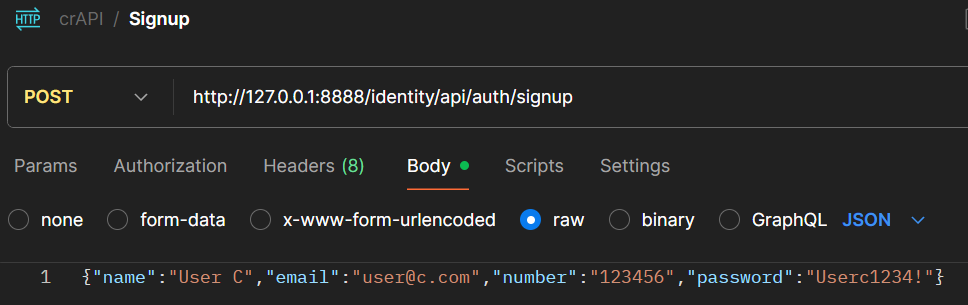

# Endpoint analyse med postman.

!!! note "Læringsmål"
    
    **Viden**

    - metoder til vurdering og efterprøvning af sikkerhedsmæssige foranstaltninger.

    **Færdighed**

    - anvende metoder til at identificere og analysere sikkerhedsmæssige svagheder i webapplikationer.
    - tolke og vurdere testresultater i forhold til kendte sikkerhedsprincipper.

!!! note "Praktiske mål"

    - Den studerende har lavet en Postman collection til crAPI.
    - Den studerende har lavet en Postman collection til Juiceshop
    - Den studerende er informeret om hvad en test case er.

!!! note "Forberedelse"


    - Læs kapitel 7 i bogen "Hacking APIs"
    - Se videon How to write test cases.
        Jeg har valgt denne video, fordi test cases skal udarbejde på samme måde, uagtet om det ser en funktionel test af softwaren man udføre, eller en pentest af software. Ignorer delen med post condition og reetablering af systemet til den oprindelige tilstand.

??? note "Reflektions punkter efter forberedelsen"

    - Hvorfor kan API dokumentationen være en godt sted at starte analysen?
        - Man kan finde ud af hvordan en API er opbygget og men kan finde ud af hvad den forventer af brugeren og hvad man som bruger kan forvente af API'en
    - Hvorfor bør man starte med at teste API’ets tiltænkte funktioner?
        - Så man kan få en fornemmelse og forståelse af hvorden dens brug er tiltænkt. Når man ved hvordan noget virker er det nemmere at finde svagheder og sårbarheder. Lige som at finde brugstilfælde og misbrugstilfælde.
    - Hvad menes der med fejl i forretnings logikken, og hvorfor kan det føre til sårbarheder?
        - Når logikken i en applikation bliver brugt mod applikationen selv.
        - Det kan føre til sårbarheder, da det er svært at scanne efter dette da, det jo eneligt er en del af funktionen, som bliver misbrugt. Det kan ske når funktioner i logikken ikke er specifik nok.
    - Hvor er dokumenteret test cases vigtige når en sårbarhed skal præsenteres for andre?
        - Ikke sikker på jeg forsår spørgsmålet.

## Opgave - Endpoint analyse med postman

!!! note "Opgave beskrivelse"
    Disse øvelser skal udføres mod crAPI:

    1. Læs afsnittet [prerequisites](https://github.com/mesn1985/HackerLab/blob/main/crAPI/4_Endpoint_Analysis_with_postman.md#prerequisites).
    1. Udfør [Øvelse 1 – Opret en ny collection i Postman.](https://github.com/mesn1985/WebApplicationSecurityBasicsLab/blob/main/crAPI/4_Endpoint_Analysis_with_postman.md#1--create-a-collection-in-postman)
    1. Udfør [Øvelse 2 – Opsnap sign-up request.](https://github.com/mesn1985/WebApplicationSecurityBasicsLab/blob/main/crAPI/4_Endpoint_Analysis_with_postman.md#2--capture-the-signup-request)
    1. Udfør [Øvelse 3 – Omgå frontend-validering.](https://github.com/mesn1985/WebApplicationSecurityBasicsLab/blob/main/crAPI/4_Endpoint_Analysis_with_postman.md#3--bypass-frontend-validation)
    1. Udfør [Øvelse 4 – Brug Postman som autentificeret bruger.](https://github.com/mesn1985/WebApplicationSecurityBasicsLab/blob/main/crAPI/4_Endpoint_Analysis_with_postman.md#4--add-authorization-token-to-postman)
    1. Udfør [Øvelse 5 – Opret nyt opslag i community.](https://github.com/mesn1985/WebApplicationSecurityBasicsLab/blob/main/crAPI/4_Endpoint_Analysis_with_postman.md#5--post-to-the-community-board)
    1. Udfør [Øvelse 6 – Opret collection via browser.](https://github.com/mesn1985/WebApplicationSecurityBasicsLab/blob/main/crAPI/4_Endpoint_Analysis_with_postman.md#6--create-a-collection-by-capturing-browser-traffic)
    1. Udfør [Øvelse 7 – Brug Burp Suite som proxy for Postman.](https://github.com/mesn1985/WebApplicationSecurityBasicsLab/blob/main/crAPI/4_Endpoint_Analysis_with_postman.md#7--use-burp-suite-as-a-proxy-for-postman)

    Derudover skal følgende øvelser udføres mod Juice Shop:

    1. Udfør [Øvelse 1 – Brug Swagger-dokumentation.](https://github.com/mesn1985/WebApplicationSecurityBasicsLab/blob/main/JuiceShop/4_Endpoint_Analysis_with_postman.md#1---exploring-swagger-documentation-for-juice-shop)
    1. Udfør [Øvelse 2 – Byg en Juice Shop collection.](https://github.com/mesn1985/WebApplicationSecurityBasicsLab/blob/main/JuiceShop/4_Endpoint_Analysis_with_postman.md#2---build-a-juice-shop-postman-collection)


### Del opgave - Opret en ny collection i Postman. 

!!! note "Opgave beskrivelse"

    1. In Postman, click the Collections tab (left panel).
    1. Click the + next to Collections and select Blank Collection.
    1. Rename it to crAPI.


### Del opgave - Opsnap sign-up request.

!!! note "Opgave beskrivelse"


    1. Use Burp Suite to capture the POST /signup request during user registration.
    1. In Postman, create a new POST request inside the crAPI collection named signup.
    1. Paste the intercepted URL into the Postman request.(Burp suite only have the path, remember to append protocol, ip and port number:)
    1. Copy the JSON body from Burp and paste it into Postman’s request body:
        - Set body type to raw
        - Set format to JSON
    1. 💾 Save the request.
    1. Click Send.
    1. Read the response message (Most likely an error, saying phonenumber already exist )

1. Use Burp Suite to capture the POST /signup request during user registration.
    
1. In Postman, create a new POST request inside the crAPI collection named signup.
    
1. Paste the intercepted URL into the Postman request.(Burp suite only have the path, remember to append protocol, ip and port number:)
    
1. Copy the JSON body from Burp and paste it into Postman’s request body:
    - Set body type to raw
    - Set format to JSON

        

1. Save the request.
    - Done
1. Click Send.
    - Done
1. Read the response message (Most likely an error, saying phonenumber already exist)
    

### Del opgave - Omgå frontend-validering.

!!! note "Opgave beskrivelse"

    1. In Postman, modify the signup request.
    1. Set a password that breaks the visible frontend policy (e.g., only 4 letters).
    1. Click Send and analyze the API response. What are the API requirements for passwords? and does the response qualify as an EDE?
    1. Correct the password, so that is forfill the API's password requirements, and send the request again.

1. In Postman, modify the signup request.
1. Set a password that breaks the visible frontend policy (e.g., only 4 letters).
1. Click Send and analyze the API response. What are the API requirements for passwords? and does the response qualify as an EDE?
    - API'en skal bruge et password der er mellem 6 og 100.
    - Jeg vil mene at det er en EDE (Exesive Data Exposure), da den exposer den fejl den løber ind i.
        
1. Correct the password, so that is forfill the API's password requirements, and send the request again.
    - Jeg har sat et password som det ses på billedet. Men det overholder faktisk ikke den password policy som siden kræver. Den kræver nemlig mindst et specialtegn, men den enforcer det ikke.
        

    - Her er dens password requirements:
        

### Del opgave - Brug Postman som autentificeret bruger.

!!! note "Opgave beskrivelse"

    1. Use Burp to capture the POST /login request and its response.
    1. Copy the token value (exclude quotes) from the response.
    1. In Postman, click the crAPI collection which will show the collection overview in the main right side window.
    1. Go to the Auth tab in the right side window.
    1. Select Bearer Token and paste the token into the token filed.

1. Use Burp to capture the POST /login request and its response.
    
1. Copy the token value (exclude quotes) from the response.
    - Done
1. In Postman, click the crAPI collection which will show the collection overview in the main right side window.
1. Go to the Auth tab in the right side window.
1. Select Bearer Token and paste the token into the token filed.

    


### Del opgave - Opret nyt opslag i community.

!!! note "Opgave beskrivelse"

    1. Capture the POST /community/post request via Burp.
    1. In Postman, create a POST request in the crAPI collection named post_to_community.
    1. Paste the URL and JSON body from the captured request.
    1. Click Send and confirm that you receive a 200 OK.
    1. Save the request.
    1. Check the crAPI UI to confirm that the post appears.

1. Capture the POST /community/post request via Burp.
    
1. In Postman, create a POST request in the crAPI collection named post_to_community.
    - Done
1. Paste the URL and JSON body from the captured request.
    - Done
1. Click Send and confirm that you receive a 200 OK.
    
1. Save the request.
    - Done
1. Check the crAPI UI to confirm that the post appears.
    

### Del opgave - Opret collection via browser.

!!! note "Opgave beskrivelse"


    1. Install Postman Interceptor to a browser of your choice(E.g. chrome).
    1. Create a new collection named crAPI-Automated.
    1. Open the crAPI app in the browser.
    1. Activate Interceptor to begin capturing.
    1. Interact with crAPI:
        - Signup and login
        - Register a vehicle (using MailHog)
        - Use Contact Mechanic, Refresh Location, buy an item, view past orders
        - Create a community post
    1. Stop Interceptor capturing.
    1. In Postman, select all captured requests → click + Save Requests
    1. Save to crAPI-Automated, organized by domain and endpoints.

Har lavet opgaven, det kan ses på biledet her.


### Del opgave - Brug Burp Suite som proxy for Postman.

!!! note "Opgave beskrivelse"

    1. In Postman: go to File > Settings > Proxy
    1. Enable Custom Proxy Configuration
    1. Set:
        - Server: 127.0.0.1
        - Port: 8080 (default Burp proxy port)
    1. Switch to General Settings, disable SSL certificate verification
    1. Open Burp Suite and ensure the proxy is listening.
    1. In Burp’s HTTP History, verify that Postman requests are now visible.

1. In Postman: go to File > Settings > Proxy
    - Done
1. Enable Custom Proxy Configuration
1. Set:
    - Server: 127.0.0.1
    - Port: 8080 (default Burp proxy port)

        - Done
1. Switch to General Settings, disable SSL certificate verification
    - Done
1. Open Burp Suite and ensure the proxy is listening.
    - Done
1. In Burp’s HTTP History, verify that Postman requests are now visible.
    

### Del opgave - Brug Swagger-dokumentation.

!!! note "Opgave beskrivelse"

    1. Explore the endpoint /api-docs/swagger.json. What endpoints are documented?
    1. What parameters are required? Are there default values?
    1. Does the quantity field have backend validation?
    1. Try to use this documentation to manually construct a valid request using Postman.
    1. Does the documentation mention authentication requirements? Is it reflected in actual API behavior?

1. Explore the endpoint /api-docs/swagger.json. What endpoints are documented?
    - Der er kun en: `POST /orders`
1. What parameters are required? Are there default values?
    - Der er ikke nogen required parameters.
    - Efter at teste den siger den `Authorization header required`
        ```json linenums="0"
        {
        "cid": "JS0815DE",
        "orderLines": [
            {
            "productId": 8,
            "quantity": 500,
            "customerReference": "PO0000001"
            }
        ],
        "orderLinesData": "[{\"productId\": 12,\"quantity\": 10000,\"customerReference\": [\"PO0000001.2\", \"SM20180105|042\"],\"couponCode\": \"pes[Bh.u*t\"},{\"productId\": 13,\"quantity\": 2000,\"customerReference\": \"PO0000003.4\"}]"
        }
        ```
1. Does the quantity field have backend validation?
    - Ikke sikker?
1. Try to use this documentation to manually construct a valid request using Postman.
    - Doen
1. Does the documentation mention authentication requirements? Is it reflected in actual API behavior?
    - Nej ikke ved første blik.

### Del opgave - Byg en Juice Shop collection.

!!! note "Opgave beskrivelse"

    Just like in crAPI - Endpoint Analysis with Postman, you will now construct your own request collection for Juice Shop.

    You can build the collection:

       - Manually (based on the Swagger documentation), or
       - By proxying browser traffic through Postman.

    Experiment to see which method gives you the best insight or coverage.

Jeg valgte at bruge Postman til automaatisk at gøre det.

## Opgave - Test cases forsat

!!! note "Opgave beskrivelse"

    - Udvid dine test cases med mere detaljeret og struktureret information.
    - Få en klassekammerat til at lave et peer review af dine test cases.

Jeg laver en test case på den BOLA jeg fandt i juiceshop i sidste uge. Jeg fik faktisk ikke lavet nogen test case for den opgave, men jeg laver en dybdegående case af den her.


#### Test case over BOLA i juiceshop
- **Opsummering** 
    - Brugerer kan se andre brugeres kurve
- **Preconditions** 
    - Dette kræver en oprettet bruger, og dermed en `Bearer token`
- **Test steps**
    1. Opret bruger A og login
    1. Brug et proxy værktøj som burp til at sniffe http trafik.
    1. Som bruger A, læg et vilkårlig produkt i kurven.
    1. Obsaver og noter det API endpoint der bliver kaldet. (fx. `/rest/basket/X`, hvor X er et nummer over 0)
    1. Opret bruger B og login
    1. Som bruger B åben den tomme kurv.
    1. Opfang reqeusten til `/rest/basket/X`.
    1. Send den til repeateren i burp, og ændre tallet hvor X'et er i eksemplerne.
    1. Ved at ændre tallet til burgers A's kurv nummer, som noteret tideligere, vil man kunne se bruger A's kurv, med bruger B's Auth Token.

- **Forventet resultat**
    - Bruger B kan se bruger A's kurv, ved at bruge sin egen `Bearer token`.
- **Egentligt resultat**
    - Bruger B kan se bruger A's kurv, ved at bruge sin egen `Bearer token`.