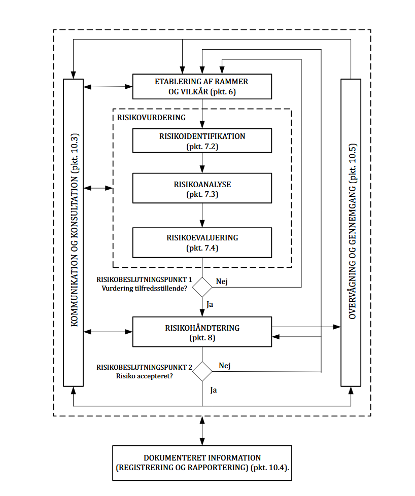

# Udviklingsproces samt domæne modellering

!!! note "Mål for ugen"

    - Den studerende har forståelse for software sikkerhedens 3 søjler.
    - Den studerende har forståelse for hvert af software sikkerhedens 7 berøringspunkter.
    - Den studerende har forståelse for samehængen mellem software udvikling og domæne forståelse.
    - Den studerende har grundlæggende forståelse for modellering af et domæne.

!!! note "Praktiske mål"

    - Hver studerende har udarbejdet en simpel domæne model.
    - Hver studerende har udarbejdet et simpel overblik over software sikkerhedens 7 berøringspunkter.

!!! note "Læringsmål"

    **Viden**

    - Den studerende har viden om hvilken betydning programkvalitet har for it-sikkerhed.
    - Den studerende har viden og forståelse for security design principles

    **Færdigheder**

    - Den studerende kan definere lovlige og ikke-lovlige input data.

    **Kompetencer**

    - Den studerende kan Håndterer risikovurdering af programkode for sårbarheder.

!!! note "Forberedelse"

    - Læs dokumentet ”Introduktion til Sikker software udvikling- Del 6”
    - Læs kapitel 2 i bogen “Secure by design”
        Hoved pointen i kapitlet er at forståelse for den forretning som softwaren understøtter, er lige så vigtigt som den tekniske kunnen.
        Herudover er forklaringen på hvad en model er, og hvordan den kan bruges til at opnå større forståelse for forretnings domænet vigtig.
    - Læs kapitel 3 i bogen “Secure by design”
    Hovedpointen her er ikke hvordan DDD virker, men hvad formålet med modellering er.

??? note "Reflektions punkter efter forberedelsen"

    - Hvorfor kan en fejl i softwarens forretnings logik blive til en sårbarhed?
        - I eksemplet fra bogen går en web shop der får et stort økonomisk tab, over at kunde kunne købe "minus" bøger. Dette gjorde at kunder der udnyttede dette fik penge for at bestille ingenting. og butikken mistede pengene. En stærkere defination på hvad "antallet" må være manglede.
    - Bør Software overholde samme domæne/forretnings logik som den forretning den understøtter?
        - Ja fordi sådan noget ville ikke ske i virkeligtheden, hvis man gik ind i en butik og køber noget.
    - Hvorfor bruger forfatteren til dagens forberedelse meget tid på at beskrive samtalen mellem udvikleren og domæne eksperten? 
        - Så man kan få en forståelse af tankegangen bag emner som "Deep modeling"
    - Hvad er forskellen mellem overfladisk modellering, og modellering i dybden?
        - **Overfladisk modellering:** Med dette er tankegangen bare at man får implementeret noget, og hvordan det kan representeres i koden. Tankerne er meget overfladiske, og man vælger det første der virker, uden at dykke dybere ned i hvordan det skal fungere.
        - **Dyb modellering:** Med dyb modellering tænker man over flere måder at implamenere noget, og vælger det bedste. Denne tankegang fokusere på at forstå det koncept man skal implamentere. Det ender med at implamenteringen er mere strikt, ved at man formår at definere hvad der er tilladt. `Eksempel: I stedet for en int quantity oprettes en klasse Quantity, der eksplicit håndhæver, at værdien altid skal være positiv`. Med denne metode kommer sikkerhed i kode automatisk.
    - Hvordan kan modellering hjælpe med  at øge sikkerheden i et stykke software?
        Hvordan kan det f.eks. hjælp med at lave en blok liste til data input?

        - Det hjælper med at man finder ud af og tænker over hvad en bestemt del skal kunne, og så er det meget nemt at finde ud af hvad den ikke skal kunne.

## Opgave - Udviklingsprocessen og Software sikkerhedens 3 søjler

!!! note "Opgave beskrivelse"

    1. Selvom vi ikke eksplicit har talt om risikostyring som et selvstændigt emne, er det alligevel en integreret del af udviklingsprocessen. Hvad kan årsagen til dette være?
    1. Hvordan håndteres risikostyring i praksis — både forretningsmæssigt og teknisk — med metoder som trusselsmodellering og risikovurdering?
    1. Hvilken ISO-standard kan anvendes til at understøtte anvendt risikostyring, og hvordan kan den bidrage til at gøre risikostyringen mere effektiv i softwareudvikling?
    1. På hvilken måde fremmer brugstilfælde og misbrugstilfælde vidensdeling blandt teammedlemmer, og hvorfor er denne vidensdeling vigtig for sikkerheden?
    1. Hvordan kan standarder og awareness-lister hjælpe med at styrke vidensdeling i et udviklingsteam? Kan I nævne eksempler på nyttige awareness-lister?
    1. Trusselsmodellering er en central metode til både at indsamle sikkerhedskrav og analysere arkitekturens risici. Hvordan understøtter trusselsmodellering disse to aktiviteter i henhold til de 7 berøringspunkter?
    1. I faget webapplikationssikkerhed fokuserer vi særligt på ét af de 7 berøringspunkter. Kan I identificere hvilket, og hvorfor det er særligt relevant i netop webapplikationssikkerhed?

1. Selvom vi ikke eksplicit har talt om risikostyring som et selvstændigt emne, er det alligevel en integreret del af udviklingsprocessen. Hvad kan årsagen til dette være?
    - Man kan ikke tage “risikostrying” som noget man bare “smider ind”. Det skal være en integreret del, da man skal tænke på risikoen.
    - “Secure by design”

1. Hvordan håndteres risikostyring i praksis — både forretningsmæssigt og teknisk — med metoder som trusselsmodellering og risikovurdering?
    - Risikostyring bliver en del af udviklingsmetoderne, eksempelvis scrum eller andre iterative processer, hvilket kan ses i dokumentet her: [Download](Introduktion%20til%20software%20sikkerhed_Del6_en_mere_sikker_udviklingsproces.pdf)
    - Forretningsmæssigt: Brugstilfælde som leder frem til misbrugstilfælde
    - Teknisk: Kommer ved trusslesmodellering

1. Hvilken ISO-standard kan anvendes til at understøtte anvendt risikostyring, og hvordan kan den bidrage til at gøre risikostyringen mere effektiv i softwareudvikling?
    - ISO27005: Vejledning i styring af informationssikkerhedsrisici
    - Det er en vejledning. Her bliver besrkevet nogle værktøjer og metoder til implementering af risikostyring

        

1. På hvilken måde fremmer brugstilfælde og misbrugstilfælde vidensdeling blandt teammedlemmer, og hvorfor er denne vidensdeling vigtig for sikkerheden?
    - Så alle kan forstå hvad det bruges til og hvad der kan misbruges. Dette er fordi sproget heri skal være “ikke teknisk” så alle ville kunne forstå det. Man får lavet et fælles sprog.
1. Hvordan kan standarder og awareness-lister hjælpe med at styrke vidensdeling i et udviklingsteam? Kan I nævne eksempler på nyttige awareness-lister?
    - OWASP top 10
    - ASVS
    - 27002
    - CIS 18
    - Det hjælper at kunne vise konkrete tilfælde med eksempler der skal sikres imod, og man kan derfra lære af hinandens fejl.

1. Trusselsmodellering er en central metode til både at indsamle sikkerhedskrav og analysere arkitekturens risici. Hvordan understøtter trusselsmodellering disse to aktiviteter i henhold til de 7 berøringspunkter?
    - Sikkerhedskrav: Man finder ud af hvad der kan angrebes og skal beskyttes imod.
    - Risiko analyse af arkitektur: Da man i trusselsmodellering skal finde ud af hvad der er sårbar, og identificere de store vigtige dele.

1. I faget webapplikationssikkerhed fokuserer vi særligt på ét af de 7 berøringspunkter. Kan I identificere hvilket, og hvorfor det er særligt relevant i netop webapplikationssikkerhed?
    - Pentest: Fordi vi analysere og rekognoscere web applikationer i black-box tests og finder sårbarheder.

## Opgave - Forstå koden

!!! note "Opgave beskrivelse"

    1. Klon [repositoriet](https://github.com/mesn1985/missingDomain).
    1. Gennemgå koden og forsøg at forstå, hvad koden gør.
    1. Vurder, om koden er sikker – og begrund jeres vurdering.

- Gennemgå koden og forsøg at forstå, hvad koden gør.
    - Det er en bank konto app, man kan deposit og withdrawal sine penge. Man kan lave en account.
    - Der er en funktion til at se en tidslinje over aktivitet på kontoen.
- Vurder, om koden er sikker – og begrund jeres vurdering.
    - Der er ikke nogen begrænsning på hvad brugeren må hede.
        - Det kunne lede til injektion sårbarheder.
    - Måden programmet håntere bruger nummer på er mærkeligt.
    - Men man kan ikke over trække, eller deposit eller trække negative mængder af penge.

Denne opgave blev svær da alt der havde noget med domænet at gøre var blevet fjernet.

## Opgave - Domænemodellering

!!! note "Opgave beskrivelse"

    1. Udarbejd en overordnet domænemodel med alle entiteter/klasser og deres relationer.
    1. Tilføj relevante attributter eller værdiobjekter til hver entitet/klasse.
    1. Vurder om navngivning og struktur i modellen og koden giver mening.
    1. Definér hvilke værdier hver attribut må indeholde (forretningsregler).
    1. Vurder om den implementerede C#-kode overholder de regler, I har fastlagt i modellen.

Vi snakkede om `number` gav mening i forhold til hvad den beskriver, som er kunde id. Så vi har sat "account id" i parentes.

Her er vores svar på opgaven. 

[DOWNLOAD PDF](Domænemodellering.pdf)

Man kunne tilføje mere modelering med bank konto ejeren.
- CPR nummer (Nu ingår GDPR)
- Fornavn
- Muligvis mellemnavn
- Efternavn
- ID (GDPR og AML regler)