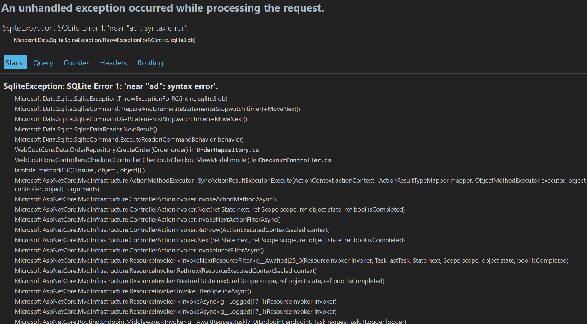
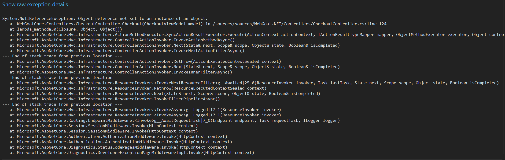
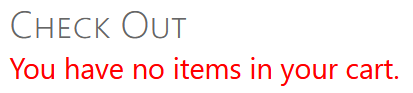
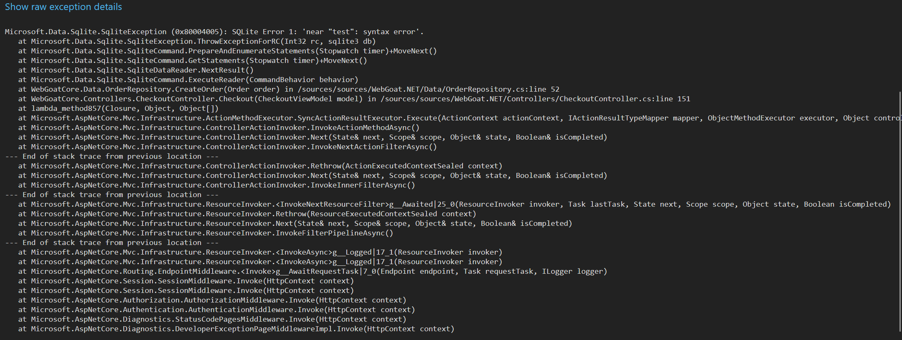

# Fejlhåndtering i software og Taint Analyse.

!!! note "Forberedelse"

    - Læs kapitel 9 i bogen “Secure by design”.
    - GenLæs Afsnit 5.4  i bogen “Secure by design”(Taint anlysis)

!!! note "Praktiske mål"

    - Den studerende kan håndtere exceptions i .Net
    - Den studerende har implementeret global exception håndtering i ASP .Net Core.
    - Den studerende kan udføre en taint analyse.

!!! note "Læringsmål"

    **Viden**

    - Den studerende har viden om trusler mod software.
    - Den studerende har viden om fejlhåndtering i software.

    **Færdigheder**

    - Den studerende kan tage højde for sikkerhedsaspekter ved håndtering af forventede og uventede fejl.
    - den studerende kan definere valid og ikke valid data til test
    - Den studerende kan opdage og forhindre sårbarheder i programkoder (Statisk kode analyse)

    **kompetencer**

    - Den studerende kan håndter risikovurdering af programkode (Med input fra taint analyse)

## Opgave - Exception som angrebsvektor

!!! note "Opgave beskrivelse"

    Projektet, du skal arbejde med og klone, er [WebGoat](https://github.com/tobyash86/WebGoat.NET).

    Først skal du verificere, at applikationen virker ved at foretage et køb. Når du har verificeret applikationens almindelige virke, skal du fremprovokere en SQL exception.
    Start applikationen, og verificer at den virker

    1. Gå til den mappe, hvor du har klonet projektet, og byg Docker-billedet med følgende kommando:

        `docker build --pull --rm -t webgoat.net .`

    1. Start applikationen med denne kommando:

        `docker run --rm -d -p 5000:8080 --name webgoat.net -e ASPNETCORE_ENVIRONMENT=Development webgoat.net`

        Her simulerer vi, at miljøvariablen fejlagtigt er sat til Development. Dette medfører, at fejlmeddelelser og stack traces vises til brugeren – en alvorlig sikkerhedsrisiko i produktion. En ikke urealitisk konfigurations fejl

    1. Opret en bruger i applikationen.

    1. Tilføj varer til indkøbskurven og gennemfør et køb.

    Fremprovoker en SQL Exception

    1. Læg nogle varer i indkøbskurven.
    1. Gå til checkout.
    1. Udfyld alle felter i checkout. Men i feltet Name to ship to skal du tilføje karakteren '.
    1. Klik Place order.
    1. Læs exceptionen og stack trace, som bliver vist. Hvilken information får du?
    1. Stack tracen viser, at linje 52 og linje 151 i kildekoden smed exceptionen. Prøv at finde disse i kildekoden. Hvad er årsagen til, at applikationen er sårbar?

    I klassen OrderRepository kan man se årsagen til sårbarheden i metoden CreateOrder:

    ```csharp
    var sql = "INSERT INTO Orders (" +
            "CustomerId, EmployeeId, OrderDate, RequiredDate, ShippedDate, ShipVia, Freight, ShipName, ShipAddress, " +
            "ShipCity, ShipRegion, ShipPostalCode, ShipCountry" +
            ") VALUES (" +
            $"'{order.CustomerId}','{order.EmployeeId}','{order.OrderDate:yyyy-MM-dd}','{order.RequiredDate:yyyy-MM-dd}'," +
            $"{shippedDate},'{order.ShipVia}','{order.Freight}','{order.ShipName}','{order.ShipAddress}'," +
            $"'{order.ShipCity}','{order.ShipRegion}','{order.ShipPostalCode}','{order.ShipCountry}')"; + ";\nSELECT OrderID FROM Orders ORDER BY OrderID DESC LIMIT 1;";
    ```
    Der bliver anvendt sammentrækning af strenge fra order-objektet, som er af typen Order. Et hurtigt kig i Order-klassen afslører, at klassen ikke håndhæver invarians eller regler af nogen slags. Endvidere har metoden Checkout i controllerklassen CheckoutController, som kalder CreateOrder-metoden i OrderRepository-klassen, ingen inputvalidering. Inputvalidering i controllerklassen, eller brug af domæneprimitiver i Order-klassen (og dermed håndhævelse af invarians), ville have kunnet mitigere denne sårbarhed.

    Sammentrækning af strenge bør aldrig anvendes til at oprette SQL-forespørgsler. Såfremt det ikke kan undgås, skal der anvendes parameterized statements. Men den bedste praksis er at anvende Object-Relational Mapper (ORM), som helt undgår brugen af tekststrenge.

    Øvrige dele af kildekoden anvender ORM til interaktion med databasen. Nedenstående er der vist et eksempel fra metoden CreateOrderPayment:

    ```csharp
    var orderPayment = new OrderPayment()
    {
        AmountPaid = Convert.ToDouble(amountPaid),
        CreditCardNumber = creditCardNumber,
        ApprovalCode = approvalCode,
        ExpirationDate = expirationDate,
        OrderId = orderId,
        PaymentDate = DateTime.Now
    };
    _context.OrderPayments.Add(orderPayment);
    _context.SaveChanges();
    ```

    ORM bør altid anvendes til interaktion med databaser fra kildekoden. Der kan undtagelsesvist i meget få tilfælde være en grund til at undlade at anvende ORM, men dette er dog meget sjældent.


Jeg fik startet web applikationen, lavet en bruger og købt et produkt.

Jeg prøver så at købe noget igen, men i "Name to ship to" skrev jeg bare `'`. Det resulterede i denne stack trace:



Hvis man trykker på "Show raw exception details", får man vist hvilken fil og hvilken linje der fejler.




Jeg har faktisk her fået den forkerte fejl. Jeg kunne dog rekreaer den to gange, men efter en restart af docker comtaineren får jeg den rigtige fejl. Dog kan den gamle fejl stadig ske fandt jeg ud af, tror det har npget at gøre med kredit kortet, fordi det sker efter man trykker på "Remember this credit card number for next time I check out."

??? note "rekreationstrin"

    1. Lav en bruger
    1. Tilføj et produkt til kurv
    1. Gå til checkout
    1. Køb produktet.
    1. Efter et succefuldt køb, tryk på tilbage knappen i din browser.
    1. Du vil blive sendt tilbage til din kurv, dog er den tom nu
        
    1. Køb igen med den tomme kurv.

    Her er noget business logic eller program flow som ikke virker ordenligt. Det sker fordi, det er tilladt at gå tilbage til checkout af en kurv, selv om den liger er blevet tømt.
    Tænk domæne moddelering, udefrakommende og tainted data bliver sammensat med ren data.



Her over er den rigtige fejl trace. Nu får jeg også den rigtige fil og linje hvor programmet fjler, som skrevet i opaven.
Ud fra den nye stack trace kan det ses at programmet bruger en sqlite3 database. og den fejler først på linje 52 i filen "OrderRepository.cs"
Ved at kigge på den linje kan man se sårbarheden. Jeg er meget sikker på at der er tale om en SQLi sårbarhed, da på linje 38 bliver der defineret et variable som indeholder en string, med en SQL query. Her bliver strings concatenated sammen til en stor string. Nogle af de små strings inde holder data som brugeren skriver ind på siden i forbindelse med shipping information. Her bliver det ikke fortaget nogen form for validering af det user input som brugeren inputter til siden. Det bliver brugt direkte i den SQL query.

```csharp
var sql = "INSERT INTO Orders (" +
    "CustomerId, EmployeeId, OrderDate, RequiredDate, ShippedDate, ShipVia, Freight, ShipName, ShipAddress, " +
    "ShipCity, ShipRegion, ShipPostalCode, ShipCountry" +
    ") VALUES (" +
    $"'{order.CustomerId}','{order.EmployeeId}','{order.OrderDate:yyyy-MM-dd}','{order.RequiredDate:yyyy-MM-dd}'," +
    $"{shippedDate},'{order.ShipVia}','{order.Freight}','{order.ShipName}','{order.ShipAddress}'," +
    $"'{order.ShipCity}','{order.ShipRegion}','{order.ShipPostalCode}','{order.ShipCountry}')";
sql += ";\nSELECT OrderID FROM Orders ORDER BY OrderID DESC LIMIT 1;";
```


## Opgave - Grundlæggende taint-analyse med Snyk

!!! note "Opgave beskrivelse"

    1. Klon projektet fra [dette repository](https://github.com/brunobritodev/ASP.NET-Core-SQL-Injection-Example).
    1. I den klonede projekts mappe, skift til mappen `SqlInjection`.
    1. Udfør taint-analysen ved at følge instruktionerne fra afsnittet `Testing a repository from its root folder` i denne [dokumentation](https://docs.snyk.io/scan-applications/snyk-code/using-snyk-code-from-the-cli/testing-your-source-code-using-the-cli).
    1. Notér, hvilket linjenummer SQL-injection sårbarheden bliver fundet på.
    1. Verificér i koden, at linjenummeret for sårbarheden er der, hvor den forurenede data sendes til sink.

Efter at køre en taint-analyse af root folderen af det repo, så finder snyk en SQL injektion.

```cmd linenums="0"
 ✗ [HIGH] SQL Injection
   Finding ID: ee67f099-6309-47bb-b1a6-ad8b8fa5c3fa
   Path: Controllers/HomeController.cs, line 32
   Info: Unsanitized input from an HTTP parameter flows into QueryAsync, where it is used in an SQL query. This may result in an SQL Injection vulnerability.
```

Jeg tjekker så filen hvor snyk finder fejlen. Det drejer sig om en en method.

```csharp
[HttpGet("SearchStudentUnsecure")]
public async Task<IActionResult> SearchStudentUnsecure(string name)
{
    var conn = _context.Database.GetDbConnection();
    var query = "SELECT FirstName, LastName FROM Student WHERE FirstName Like '%" + name + "%'";
    IEnumerable<Student> students;

    try
    {
        await conn.OpenAsync();
        students = await conn.QueryAsync<Student>(query);
    }

    finally
    {
        conn.Close();
    }
    return Ok(students);
}
```

Denne method tager input fra en bruger som skriver sit navn. Dette data er taintet data, da det kommer ude fra. Der er ingen validering af dette data, og dette program tager det med directe ind i en SQL qurey. Dette vil med stor sikkerhed føre til SQLi.

## Opgave - Taint-analyse med falsk positiv

!!! note "Opgave beskrivelse"

    1. I klassen `HomeController`, opret en privat metode til validering af en tekststreng. Teksten må kun indeholde alfabetiske karakterer.
    1. I metoden `SearchStudentUnsecure` skal du nu bruge valideringsmetoden til at validere tekststrengen name. Valideringsmetoden skal være den første metode, der bliver kaldt.
    1. Eksekver taint-analysen med Snyk.
    1. Notér, om SQL Injection stadig detekteres som en sårbarhed.

Jeg tilføjer en privat metode som validere om navnet kun indeholder valide karaktere, og der bliver kastet en exception hvis der er andet end små eller store bogstaver. Denne metode bliver kaldt som det første inde i `SearchStudentUnsecure` metoden. Dette gør at navnet bliver valideret ordenligt.

```csharp
private async validate(string name)
{
    var pattern = new Regex(@"^[a-zA-ZæøåÆØÅ]+");
    if (pattern.IsMatch(name))
    {
        return;
    }
    else
    {
        throw new ArgumentException("Name must be an alphabetic character");
    }
}

[HttpGet("SearchStudentUnsecure")]
public async Task<IActionResult> SearchStudentUnsecure(string name)
{
    validate(name);
    var conn = _context.Database.GetDbConnection();
    var query = "SELECT FirstName, LastName FROM Student WHERE FirstName Like '%" + name + "%'";
    IEnumerable<Student> students;

    try
    {
        await conn.OpenAsync();
        students = await conn.QueryAsync<Student>(query);
    }

    finally
    {
        conn.Close();
    }
    return Ok(students);
}
```

Jeg køre en nye taint-analyse med snyk-CLI. Igen viser den en SQL injection, selv om den udefra kommende data faktisk bliver valideret inden det bliver brugt. Dette er en falsk opsitiv.


```cmd linenums="0"
 ✗ [HIGH] SQL Injection
   Finding ID: ee67f099-6309-47bb-b1a6-ad8b8fa5c3fa
   Path: Controllers/HomeController.cs, line 49
   Info: Unsanitized input from an HTTP parameter flows into QueryAsync, where it is used in an SQL query. This may result in an SQL Injection vulnerability.
```