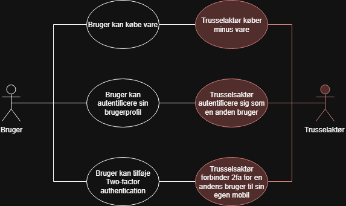
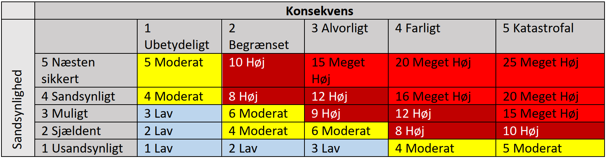
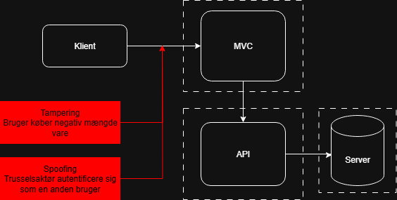

# Risikovurdering og trusselsmodellering

!!! note "Læringsmål"

    **Viden**

    - Den studerende har viden om trusler mod software
    - Den studerende har viden og forståelse for security design principles

    **Færdigheder**

    - Den studerende kan sikkerhedsvurdere et givet software arkitektur

!!! note "Praktiske mål"

    - Alle studerende har deltaget i udarbejdelsen af system og sikkerheds mål til en web applikation
    - Alle studerende har deltaget i udarbejdelsen af risiko vurdering af sikkerheds mål til en web applikation.
    - Alle studerende har deltaget i udarbejdelsen af en trusselsmodellering af en web applikation.

!!! note "Forberedelse"

    - Læs dokumentet ”Introduktion til Sikker software udvikling- Del 4”
    - Læs dokumentet ”Introduktion til Sikker software udvikling- Del 5”

??? note "Reflektions punkter efter forberedelsen"

    - Hvordan hjælper risiko analysen med priorterer udviklingen af sikkerheden?
        - Når man beregner hverd risiko med formlen `Risiko = Konsekvens * Sandsynlighed` får man et tal, så man kan derfor rangerer alle misbrugstilfældene.
    - Hvorfor er en kvalitativ risiko vudering mere pragmatisk for et team?
        - Da det er nemmere at beasere misbrugstilfælde på en scala, så man nemt kan finde ud af hvilke misbrugstilfælde der er vigtigst.
    - Hvilket input skaber risikoanalysen til trusselsmodelleringen?
        - De misbrugstilfælde med højst risikoværdi.
    - Hvorfor bør man udvælge en specifik del af software systemet når man laver trussels modellering?
        - Så processen ikke bliver for stor og uoverskuelig.
    - Er det nok at lave en trusselmodellering en enkel gang?
        - Nej det skal gøres flere gange løbene.
    - Hvor mange detajler bør man medtage i sin trussel modellering?
        - Nok til at have det med, men ikke for dybt, 
    - Hvad er forskellen på sikkerheds mål, og sikkerhedskrav?
        - **Sikkerhedsmål** er det samme som misbrugstilfælde, og beskriver hvad der ikke må ske med systemet.
        - **Sikkerhedskrav** er sikkerhedsmål som er blevet kategoriseret med STRIDE modellen og har fået en af 6 kategorier.

## Opgave - Udarbejd system- og sikkerhedsmål til webapplikation

!!! note "Opgave beskrivelse"

    Applikationen kan findes [her](https://github.com/dotnet-architecture/eShopOnWeb).

    - Start applikationen og besøg [hjemmesiden](http://127.0.0.1:5106).
    - Identificer titler på 3 brugstilfælde, og noter dem på et brugstilfældediagram.
        
        Bemærk: Her handler det om at identificere – ikke udarbejde detaljerede beskrivelser endnu.
    - Brainstorm og identificer mindst 3 misbrugstilfælde ud fra brugstilfældediagrammet.
        
        Bemærk: Stadig kun identificering, ikke fuld udarbejdelse.
    - Udarbejd minimum 1 brugstilfælde detaljeret – gerne flere.
        
        At udarbejde betyder at beskrive brugstilfældet i detaljer.
    - For hvert udarbejdet brugstilfælde, udarbejd minimum 1 misbrugstilfælde.

- Identificer titler på 3 brugstilfælde, og noter dem på et brugstilfældediagram.
    - Bruger køber vare
    - Bruger autentificere sig på hjemmesiden
    - Bruger kan tilføje Two-factor authentication

- Brainstorm og identificer mindst 3 misbrugstilfælde ud fra brugstilfældediagrammet.
    - Trusselaktør køber minus vare
    - Trusselsaktør autentificere sig som en anden bruger
    - Trusselsaktør forbinder 2fa for en andens bruger til sin egen mobil

- Udarbejd minimum 1 brugstilfælde detaljeret – gerne flere.

    |Brugstilfælde a: Bruger køber vare|
    |---|
    |Forudsætning: Brugeren er logget ind via email/username og password, og er i stand til at lægge en eller flere varer i sin kurv.|
    |Brugeren trykker på “Add to basket” knappen, hvorefter brugeren bliver sendt videre til sin kurv, med mulighed for at ændre antallet af de bestemte varer, derefter kan brugeren trykke “check out” og så “Pay now”|

    |Brugstilfælde b: Bruger autentificere sig på hjemmesiden|
    |---|
    |Forudsætning: Brugeren har en konto at tilgå via email/username og password|
    |Brugeren autentificerer sig via at taste oplysninger ind i login formlen på hjemmesiden hvor brugeren derefter trykker på “login” knappen. Brugeren bliver derefter redirected til webshoppens forside.|

- For hvert udarbejdet brugstilfælde, udarbejd minimum 1 misbrugstilfælde.

    |Misbrugstilfælde a: Trusselaktør køber minus vare|
    |---|
    |Forudsætning: Trusselaktør har logget ind og at input validering ikke er til stede.|
    |Den ondsindede aktør ændre i http request body’en, til at sende en negativ kvantitet af vare, hvorefter hjemmesiden bekræfter “købet” og aktøren får penge tilbage.|
    |Foranstaltning: Implementering af input validering.|

    |Misbrugstilfælde b: Trusselsaktør autentificere sig som en anden bruger|
    |---|
    |Forudsætning: Den ondsindede aktør har en andens brugers login oplysninger/eller en anden brugers session-token|
    |Den ondsindede aktør indtaster de stjålne login oplysninger og autentificere sig som en anden bruger, eller den ondsindede aktør udfører http-metoder via en anden brugers session-token.|
    |Foranstaltning: Brugeren har mulighed for at tilføje 2 factor authentication|
    |Bemærkning: Hvis den ondsindede aktør har adgang til en anden brugers session-token, selv med 2 factor authentication, er truslen stadig aktuel.|

    

## Opgave - Udarbejd risikovurdering til webapplikation

!!! note "Opgave beskrivelse"
    - Udarbejd en kvalitativ skala for konsekvens (fx lav, medium, høj).
    - Udarbejd en kvalitativ skala for sandsynlighed (fx sjælden, mulig, sandsynlig).
    - Tilknyt en numerisk score til hvert niveau på skalaerne for bedre overblik (fx 1–5).
    - Brug skalaerne til at fastslå sandsynlighed og konsekvens for hvert misbrugstilfælde.
    - Beregn risikoen for hvert misbrugstilfælde med formlen: `Risiko = Sandsynlighed * Konsekvens`

- Udarbejd en kvalitativ skala for konsekvens.
    - 1 - Ubetydeligt 
    - 2 – Begrænset
    - 3 – Alvorligt
    - 4 – Farligt 
    - 5 - Katastrofalt

- Udarbejd en kvalitativ skala for sandsynlighed.
    - 1 - Usandsynligt
    - 2 – Sjældent
    - 3 – Muligt
    - 4 – Sandsynligt
    - 5 - Næsten sikkert

- Tilknyt en numerisk score til hvert niveau på skalaerne for bedre overblik.

    

- Brug skalaerne til at fastslå sandsynlighed og konsekvens for hvert misbrugstilfælde.
    - Trusselaktør køber minus vare
        - Sandsynlighed: 5, Næsten sikkert 
        - Konsekvens: 3, Alvorligt 
    - Trusselsaktør autentificere sig som en anden bruger
        - Sandsynlighed: 2, Sjældent 
        - Konsekvens: 4, Farligt 
    - Trusselsaktør forbinder 2fa for en andens bruger til sin egen mobil
        - Sandsynlighed: 1, Usandsynligt
        - Konsekvens: 4, Farligt 

- Beregn risikoen for hvert misbrugstilfælde med formlen: 

    `Risiko = Sandsynlighed * Konsekvens`

    - Trusselaktør køber minus vare
        - Risiko: 15
    - Trusselsaktør autentificere sig som en anden bruger
        - Risiko: 8
    - Trusselsaktør forbinder 2fa for en andens bruger til sin egen mobil
        - Risiko: 4

## Opgave - Udarbejd trusselsmodellering til webapplikation

!!! note "Opgave beskrivelse"

    - Identificer de vigtigste komponenter i jeres system (fx frontend, backend, DB).
    - Tegn et blokdiagram over arkitekturen.
    - Marker tillidsgrænser (fx mellem bruger og system, API og DB).
    - Udvælg ét misbrugstilfælde med høj risiko.
    - Brug STRIDE til at finde relevante trusler i arkitekturen.
    - Notér jeres fund.

- Identificer de vigtigste komponenter i jeres system (fx frontend, backend, DB).
    - Klient
    - Frontend
    - API
    - SQL server

- Udvælg ét misbrugstilfælde med høj risiko.
    - Vi har valgt det misbrugstilfælde med en risiko på 15, som er: Trusselaktør køber minus vare
- Brug STRIDE til at finde relevante trusler i arkitekturen.
    - Ved brug af [STRIDE](../../../Generelt%20Teori/STRIDE.md), fandt vi frem til at det valgte misbrugstilfælde høre inde under Tampering
- Notér jeres fund.

    Vi fandt frem til at begge vores misbrugstilfælde sker mellem klienten og MVC.
    