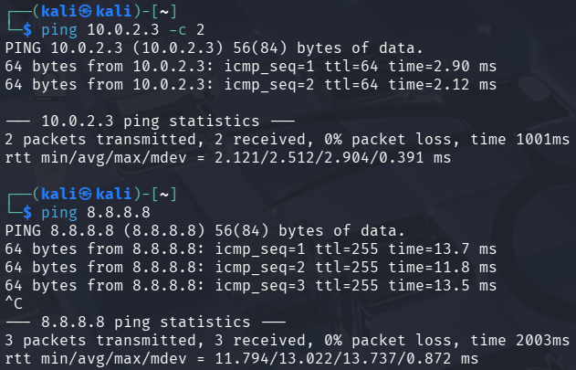
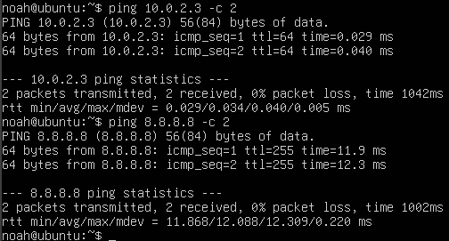

# Introduktion til faget System sikkerhed

## Opgave - Fagets læringsmål

??? note "Opgave beskrivelse"

    1. Læs og reflekter over læringsmålene individuelt¶
    
        Tidsestimat: 20 minutter
        
        Hvert teammedlem skal individuelt læse og reflektere over studieordningens læringsmål for faget System sikkerhed.

    2. Notér et konkret eksempel på hvert læringsmål¶

        Tidsestimat: 20 minutter
        
        Hvert teammedlem skal individuelt notere ét eller flere konkrete eksempler, der relaterer sig til hvert læringsmål.
        
        Som 1. semester-studerende kan dette være svært. Der er ikke noget rigtigt eller forkert – det handler om, hvad du allerede ved, eller kan finde frem til.

    3. Skab en fælles forståelse i gruppen¶
    
        Tidsestimat: 30 minutter
        
        Benyt en struktur, der sikrer, at alle gruppemedlemmers synspunkter bliver hørt. Del og diskuter de konkrete eksempler, der relaterer sig til hvert læringsmål – gerne flere eksempler pr. læringsmål.

    4. Efter pausen: Del i Padlet¶
    
        Tidsestimat: 15 minutter
        
        Gruppen skal nu skrive udvalgte læringsmål og tilhørende konkrete eksempler ind i den fælles Padlet.
        
        Herefter laver vi en fælles opsamling, hvor hvert team præsenterer deres eksempler i plenum.

Her er vores eksempler:

Viden

Den studerende:

- har viden om generelle governance principper og sikkerhedsprocedurer Ansvarsfordeling, gennemsigtighed, risikostyring, compliance, kontrol og opfølgning
    - ISO27001, NIS2, GDPR, CIS18
    - Adgangsprocedure
- har viden om metode og praksis inden for væsentlige forensic processer
    - Analyse af it udstyr som drives, eller ram.
    - Identificering af en hændelse, indsamling af data (sørge for, at det er sikkert), bevarelse af data (sørge for, at det ikke kan ændres), analyse af hændelsen (find spor og evt. sammenhænge) og rapportering af alt ovenstående
- kan forstå og reflektere over relevante it-trusler
    - Kendskab til forskellige it-trusler, f.eks. phising, malware, DDoS-angreb, insider trusler, osv.
- har kendskab til teorier, metode og praksis inden for sikkerhedsprincipper til systemsikkerhed
    - CIA-triaden, Defense in Depth, least privilege
- kan forstå og reflektere over sikkerhedsprincipper til systemsikkerhed, herunder overvejelser om adgangskontrol
    - Authentication, authorization, accounting
- Har viden om teorier, metode og praksis i forhold til sikkerhedsadministration i DBMS.
    - SQL Injection, backup, kryptering og rettigheder

Færdigheder

Den studerende:

- kan anvende metoder og redskaber til at implementere systematisk logning og monitering af enheder. Følge et benchmark til at sikre opsætning af enhederne, analysere logs for hændelser samt udnytte modforanstaltninger til sikring af systemer
    - Hvordan logs indsamles, hvordan enheder konfigureres sikkert, etablering af monitorering og alarmer, forebyggelse og styrkelse af sikkerheden
- kan analysere logs for incidents og følge et revisionsspor
    - Bruge SIEM
- kan anvende metoder og redskaber til at identificere forskellige typer af endpoint-trusler og kan vælge relevante løsningsmodeller at fjerne eller afbøde trusler mod systemer samt genoprette systemer efter en hændelse.
    - At opfange trusler på netværket og bestemme den bedste løsning for at undgå angrebet.
- formidle praksisnære praksisnæreproblemstillinger og løsningsmuligheder til samarbejdspartnere og brugere.
    - Kunne kommunikere på et niveau, så alle kan være med.
    - Højt abstraktionsniveau

Kompetencer

Den studerende:

- kan håndtere komplekse og udviklingsorienterede situationer i forhold til at håndtere enheder på command line-niveau
    - At lære at bruge linux command line, til it sikkerhed.
- kan selvstændigt indgå i fagligt og tværfagligt samarbejde og påtage sig ansvar inden for rammerne af en professionel etik i forhold til udvælgelse, anvendelse og implementering af praktiske mekanismer til at forhindre, detektere og reagere over for specifikke it- sikkerhedsmæssige hændelser
    - Arbejde med og implementere SIEM værktøj.
- kan håndtere værktøjer til at identificere og fjerne/afbøde forskellige typer af endpoint trusler
    - Kan bruge ting som threatlocker? -> Endpoint Protection
- kan identificere egne læringsbehov og udvikle egen viden, færdigheder og kompetencer i relation til systemsikkerhed.
    - At kunne arbejde selvstændigt, og sørge for egen læring?

## Opgave - Kali linux og Ubuntu server opsætning

??? note "Opgave beskrivelse"

    Jeg er gået igennem og har færdiggjordt alle de følgende opgaver.
    
    - [Opsætning af Oracle Virtualbox](https://26f-its-syssec-378707.gitlab.io/exercises/1_1_Ops%C3%A6tning_virtual_box/)
    - [Opsætning af Ubuntu server](https://26f-its-syssec-378707.gitlab.io/exercises/1_2_Ops%C3%A6tning_ubuntu_Server/)
    - [Opsætning af kali linux](https://26f-its-syssec-378707.gitlab.io/exercises/1_3_Ops%C3%A6tning_Kali_Linux/)
    - [Validering af netværks forbindelse](https://26f-its-syssec-378707.gitlab.io/exercises/1_4_Validere_forbindelse_mellem_Kali_Og_Ubuntu_Server/)

Her kan det ses af der er forbinderlse mellem Kali linux (10.0.2.4) og Ubuntu serveren (10.0.2.3)

Kali linux har forbindelse til både Ubuntu serveren og dns server `8.8.8.8`

Ubuntu server har forbindelse til både Kali linux og dns server `8.8.8.8`
