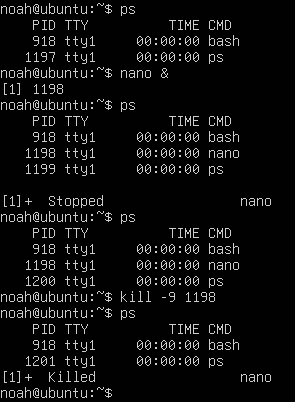

# Grundlæggende introduktion til Linux og operativsystemer

## Opgave - Linux file system

!!! note "Opgave beskrivelse"
    Hvad er der i de forskellige directories?

|Directory|Purpose|
|---|---|
|/|The root of the file system|
|/bin|for essential user command binaries used by all users, such as cp, ls, sh, mount|
|/boot|for static files for the bootloader, including the kernel|
|/dev|for device files representing system hardware|
|/etc|for host-specific system configuration files and must not contain binary executables|
|/lib|for shared libraries and kernel modules required by binaries in /bin and /sbin|
|/media|holds mount points for removable media such as USB drives or CDs|
|/mnt|holds temporary mount point for filesystems intended for manual use by system administrators|
|/opt|holds add-on application packages, with each package in its own subdirectory|
|/run|stores runtime variable data cleared on boot, including process IDs and UNIX-domain sockets|
|/sbin|for essential system binaries for booting and system recovery, such as fsck and shutdown|
|/srv|for site-specific data served by the system, such as web or FTP data|
|/tmp|holds temporary files, which are not preserved across reboots|
|/usr|secondary hierarchy for read-only user utilities and applications|
|/var|for variable data like logs, mail, and spool files|

## Opgave - Processer i linux

!!! note "Opgave beskrivelse"

    Denne opgave handler om at finde processer, genstarte og stoppe processer. 

```cmd linenums="0"
> ps # outputter alle kørende processer for egen bruger.

> ps #aux outputter alle kørende processer på systemet.
    a # Løfter en begrænsning til "kun egen bruger"
    u # Display user-oriented format.
    x # list all processes

> ps -C navn # Giver en mulighed for at søge efter commandoen.

> nano & # Smider nano til baggrunden.

kill -1 <PID> # Her kan man genstarte en process ud fra dens PID.
kill -9 <PID> # Her kan man stoppe en process ud fra dens PID.
```

Her er et eksempel på at starte nano i baggrunden og finde dets PID, og så stoppe den igen.

