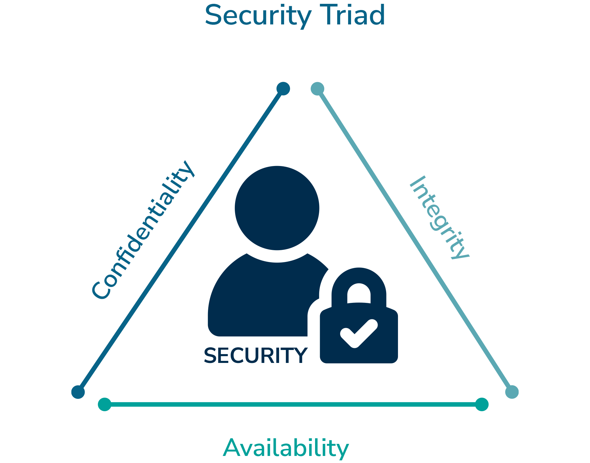

# CIA modellen | CIA Triad

CIA modellen/triad står for **fortrolighed (Confidentiality)**, **integritet (Integrity)** og **tilgængelighed (Availability)**, som er de tre kerneprincipper i IT-sikkerhed. Organisationer bruger denne model til at sørge for, at deres data og information forbliver fortrolige og kun tilgængelige for godkendte personer, at data bevarer sin integritet og ikke bliver ændret eller slettet, samt at data altid er tilgængelige.

Alle cyberangreb falder ind under en af disse kategorier.

## C Fortrolighed (Confidentiality)

Fortrolighed handler om, at information kun er kendt af bestemte personer. Det kan være forretningshemmeligheder, økonomiske data, personfølsomme oplysninger og meget andet – altså information, man ønsker at holde hemmelig.

Der er brud på fortroligheden af information, hvis en hacker eller andre får adgang til data, de ikke burde have adgang til.

Måder at opnå fortrolighed på:

- **Kryptering**: Data krypteres, så de kun kan læses af den rette modtager, der dekrypterer dem. Hvis data opsnappes, er de ubrugelige uden nøglen.

- **Adgangsbegrænsning**: Medarbejdere får kun adgang til de data, de behøver for at udføre deres arbejde. Fx skal marketing ikke have adgang til regnskabs- eller IT-afdelingens data.

- **To-faktor-autentificering (2FA)**: En ekstra sikkerhedsforanstaltning, der sikrer, at kun den rette bruger kan få adgang.

## I Integritet (Integrity)

Integritet handler om at sikre, at data og information ikke bliver ændret eller slettet – hverken ved nedbrud, hackerangreb eller menneskelige fejl. Vi kan ikke have data, der går tabt eller bliver manipuleret, da det kan få store konsekvenser.

Måder at opnå integritet på:

- **Hashing**: Bruges til at kontrollere integriteten af modtagne data. Afsenderen hasher dataene og sender hashen med. Modtageren kan så kontrollere, om dataene stemmer overens.

- **Digitale signaturer**: Kombinerer hashing med asymmetrisk kryptering, så vi kan verificere både dataintegritet og afsenderens identitet.

- **Certifikater**: Giver ekstra sikkerhed ved dataoverførsel mellem enheder.

## A Tilgængelighed (Availability)

Tilgængelighed handler om at holde systemer og data kørende og tilgængelige for både brugere og organisationer. Vi er meget afhængige af, at data altid er tilgængeligt. Hvis en webshop går ned, kan de miste millioner, og hvis en bank-app ikke virker, kan det være umuligt at betale for varer og tjenester.

Måder at sikre tilgængelighed på:

- *Redundans*: Opbygge systemer med backup og alternativer, så de altid er tilgængelige.

- **Fejltolerance**: Systemer designes til at kunne fortsætte, selv når fejl opstår.

- **Patching**: Lukker sikkerhedshuller og sikrer stabilitet, så systemerne ikke kan udnyttes til at skabe nedbrud.