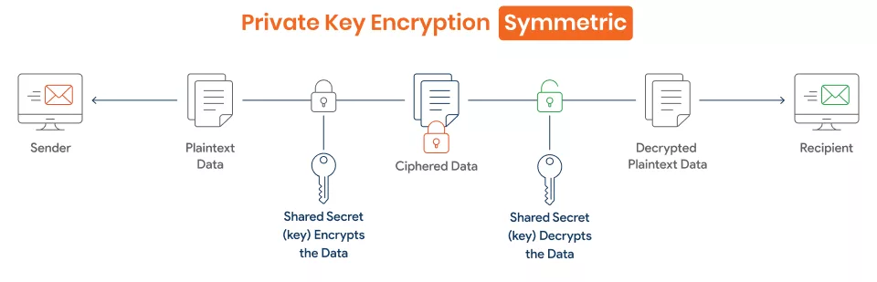
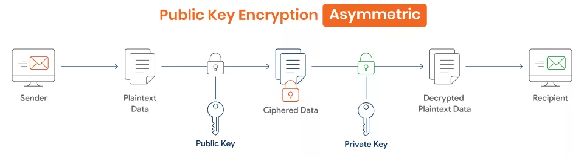
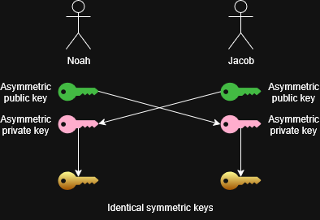

# Encryption

## Public key infrastructure
Public key infrastructure or PKI is a broad term, and commonly reference to Policies, procedures that is responsible for creating, distributing, managing, storing, revoking and other processes associated with digital certificates.

## Symmetric encryption

In symmetric encryption only a single key is generated, and this key can both encrypt and decrypt the same data. This is typically seen in movies where the goal is go get a briefcase that is handcuffed to a delivery person. If the key gets out, you'll need another key.

This type of encryption does not scale very well, because if 10 people want to have private encrypted chats with each other they all need to keep track of which key each person uses, and it just gets harder from there, not to mention of one of them intercepts an encrypted message they can also decrypt it and see the data.

Today symmetric encryption is still being used despite its inherent flaws, because it is very fast to use compared to asymmetric encryption. Because of this they both get used, to compensate for their individual flaws. the SHH protocol uses both.

## Asymmetric encryption

Compared to symmetric encryption, asymmetric encryption encrypts with 2 different keys. One private and one public. The private key is used to decrypt data, and the public is used to encrypt that data. Just like the names say the private key should stay private, and the public key you are free to give away. because the two key are mathematically related, someone with your public key can encrypt anything, and cannot use the public key to make a copy of you're private key.
The key pair

Asymmetric encryption is known as public key cryptography.

when generating the keys, they are both made at the same time, using lots of randomization, large prime numbers, and lots of math. If me and my friend Jacob want to message each other using public key cryptography, we each need to make a key pair. We then send each other our public keys, and before i send him a message i encrypt it using his public key, and when he receives that ciphertext (the encrypted message), he can then decrypt it with his private key, and vise versa. Anyone with access to the ciphertext and the public key that encrypted it, have no way of finding out what is inside, and they can't reverse engineer the public key.

## key exchange
How do you send others the key they need to decrypt some data? sending it over the internet is dangerous because someone else could intercept it and also get access to the data.

You could do it manually, over the phone, using a courier, or in person. On the internet, you  and someone else generate an asymmetric key pair (One private and one public) and exchange public keys. Then, using your private key and the other party’s public key, you can each create the same shared symmetric key. This process allows you to establish session keys securely over the internet, without directly transmitting the symmetric key. This is also how [TLS](https://www.cloudflare.com/learning/ssl/transport-layer-security-tls/) works.

If Jacob and Noah wants to create a symmetric key, over the network they could do that. If Jacob and Noah both generate a asymmetric key pair (One private and one public), they could then send each other their public keys. Then Jacob combines his private key, and Noah's public key and vice versa. They each create the exact same symmetric key, because their keys were mathematically related.

