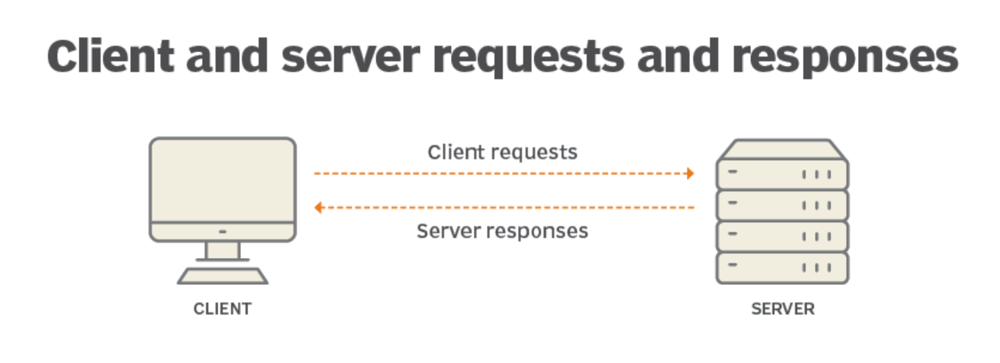
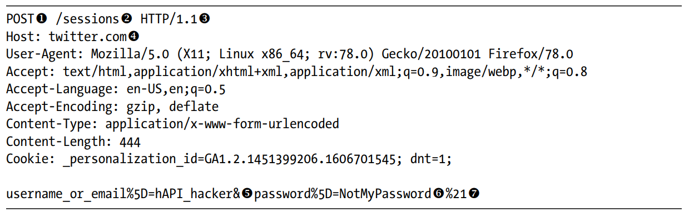
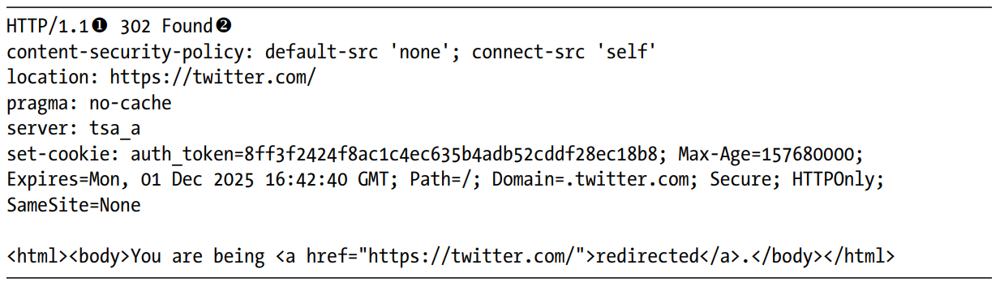

# HyperText Transfer Protocol | HTTP

HTTP er en stateless protocol, som køre på en request/responnce basis. Det vil sige at den ikke gemmer hvem du er efter hverd request, og den køre på ***client/server*** modellen. Client/server modellen virker på den måde at den som requester data/ressourcer, er en client, og den som modtager en request er en serveren. Når du bruger din browser til at besøge en hjemmeside, fungere den som clienten, da den requester ressourcer fra en hjemmeside. Serveren fungere som en samling af filer og ressourcer, så som html, css, js filer billeder og andet. Når en server får en request skal den behandle den request: Tjekke om klienten er autoriseret, til at requeste det de gør, og alt efter hvordan den request er opbygget skal serveren svare med et passende responce.

*Figur 1*

## HTTP requests

Som nevnt så sender klienten en request til serveren efter et bestemt ressource. Denne request består af mange mindre dele som er godt at vide noget om. 

*Figur 2*

På billedet her over ses en request når man prøver at godkende sig selv på twitter.com, via deres login side.

### Punkt 1

Punkt 1 står ud for den aller første del af vores request. Dette er den brugte ***method***. Methods forteller serveren hvad man prøver at gøre med sin request, `POST` bruger man når man som klienten skal sende data til serveren som den skal bruge. På billedet bruges der POST da man prøver at logge ind på twitter, derfor sender vi vores username eller email, og vores password, som kan ses nederest på billedet. Der findes flere methods som kan ses i listen her:

|Method|Beskrivelse|
|---|---|
|GET|Bruges til at hente ressourcer fra serveren.|
|HEAD|Lige som GET, men anmoder kun om HTTP-headers og undlader "response content".|
|POST|Bruges til at sende data til serveren.|
|PUT|Bruges til at opdatere data/ressourcer på serveren.|
|DELETE|Bruges til at slette data/ressourcer fra serveren.|
|CONNECT|Bruges til at skabe en tovejs netværksforbindelse, mellem klient og server.|
|OPTIONS|Bruges til at spørge siden om hvilke methods den tillader|
|TRACE|Bruges til at debugge.|

### Punkt 2

Punkt 2 er den path som det efterspurgte ressource har. Det path som bliver brugt kan være det fulde, abselutte eller relative path, i dette tilfælde bliver der brugt et relativ path. Det fulde path vil være:

`https://twitter.com/sessions`

### Punkt 3

Punkt 3 viser hvilken HTTP protokol verion der bliver brugt.

### Punkt 4

Punkt 4 handler om HTTP ***headers***. Headers fungerer som key-value pairs, der overfører yderligere information om anmodningen eller svaret mellem klienten og serveren. Headers bliver skrevet sådan: `header-navn:værdi`, og i dette tilfælde står punkt 4 ud for `Host` headeren, hvor værdien er twitter.com. Under er der en header ved navn `User-Agent` som siger til serveren hvilken browser vi bruger.

Her er et link til en liste over alle [request headers](https://developer.mozilla.org/en-US/docs/Web/HTTP/Reference/Headers)

### Punkt 5, 6 og 7

Alt under headersne er ***message body*** som er det information/data som vi prøver at få serveren til at behandle så vi kan logge ind på twitter. I dette tilfælde består den af username og password, hvilke serveren skal bruge for at godkende os. Mange speciel tegn bliver encoded med URL-encoding eller andet for at behandle tegn som kunne give problemer. et udråbstegn `!` bliver encoded til at være `%21`.

## HTTP responces

Efter twitter serveren modtager vores HTTP request, vil den behandle og bag efter svare med et HTTP responce. Typen af svaret kommer an på flere faktorer, så som tilgængeligheden af ressourcet, om brugeren er godkendt til at tilgå ressourcet, web serverens helbred, og flere andre.

*Figur 3*

### Punkt 1

Den første ting man finder i et http responce er versionen i brug.

### Punkt 2

Punkt 2 er den kode som serveren giver tilbage til klienten. I dette tilfælde er det en `302 Found` som betyder at men bliver redirected (Man bliver vidersendt til en anden side). Her bliver vi redirected til `https://twitter.com/` da vores username og password blev godtaget som en bruger hos twitter, og vi er blevet logget ind.

### Resten

Resten af responcen ligner meget den request vi sendte tideligere, hvor det er **http headers** og **message body** som er tilbage. Hvis man hurtigt kigger så kan man se `location: https://twitter.com/` som er den URL vi bliver vidresendt til. Man kan også se at den bruger `set-cookie: auth_token=...; Max-Age=...;` det er den cookie, som Twitters server har givet klienten for den session, vi lige har startet. Serveren bruger denne header til at oprette eller opdatere en cookie hos klienten. Browseren sørger for at gemme den og automatisk sende den tilbage i HTTP-headeren `Cookie`, når vi igen skal godkendes – uden at brugeren behøver gøre noget.

I **message body** fortæller den os at vi bliver redirected.

## HTTPS med TLS

HTTP er dog ikke sikkert, da alt bliver send i rent tekst, som vi kan se i figur 2, så kan man se hvad ens brugernavn og kodeord er og alt andet data som ingen andre burde se. Det er ikke sikkert, for hvis andre kan stå i midten af klienten og serveren, så vil de kunne se hvad der bliver sendt frem og tilbage. Dette er kendt som et Man In the Middle attack.

Svaret på dette er at bruge HTTP med [Transport Layer Security](https://www.cloudflare.com/learning/ssl/transport-layer-security-tls/) (TLS)

TLS er en protocol der er lavet til at give brugere privatliv og gøre data sikkert når man kommunikere over internettet. TLS sikre data med to af tre dele af [CIA modellen](CIAModellen.md), ved at holde data fortroligt med [kryptering](kryptering.md), og sørge for at dataen ikke er blevet ændret eller gået tabt.